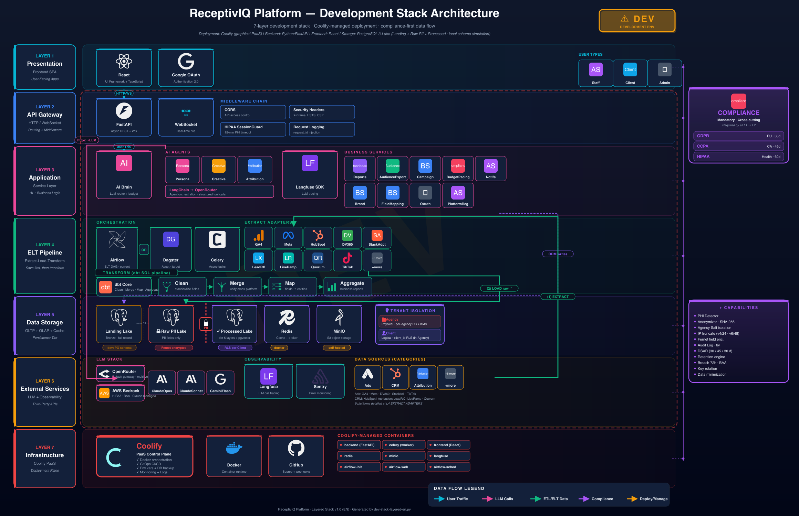
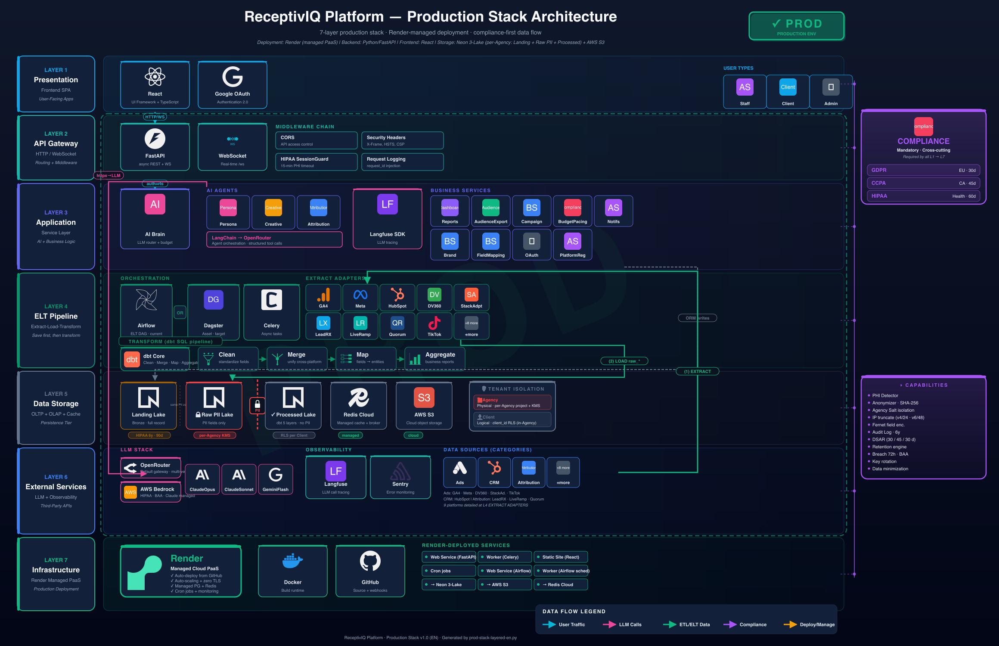
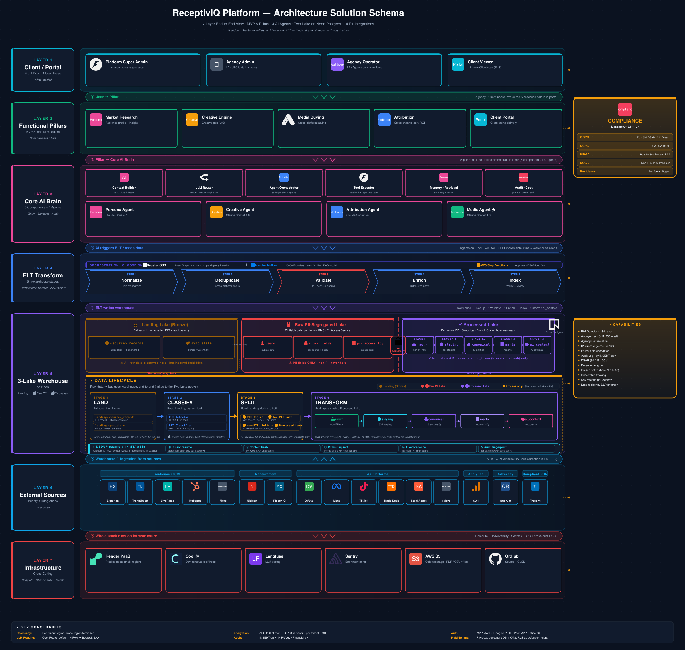

**English** | [中文](README.zh-CN.md)

# ReceptivIQ Platform

> AI-native Agency OS — A GDPR / CCPA / HIPAA compliant marketing intelligence platform

_Last updated: **2026-05-21**_

## Architecture at a Glance

### Technical — Development Stack



> Layered view of the local development stack: Docker Compose services, hot-reload toolchain, mocked external integrations, and developer-facing observability. See [`docs/diagrams/env-stack-glossary.md`](docs/diagrams/env-stack-glossary.md) for a per-layer glossary.
> Source: [`docs/diagrams/dev-stack-layered-en.py`](docs/diagrams/dev-stack-layered-en.py).

### Technical — Production Stack



> Layered view of the production stack: managed Postgres / Snowflake / S3, Render-hosted services, async Celery workers, ETL adapters with live third-party credentials, full observability (Langfuse + Sentry + audit pipeline).
> Source: [`docs/diagrams/prod-stack-layered-en.py`](docs/diagrams/prod-stack-layered-en.py).

### Customer-facing (sales / exec deck)



> PSD-grade architecture schema for customers and auditors — depicts the 3-Lake Medallion (Landing / Raw PII / Processed), PII boundary, Shared Reference Lake, dbt 5-layer transform, AI Agent surface, and the compliance overlay (audit, DSAR, retention).
> Source: [`docs/psd/architecture-schema-en.svg`](docs/psd/architecture-schema-en.svg) · Explainer: [`docs/psd/architecture-schema-explained.md`](docs/psd/architecture-schema-explained.md).

### Data Pipeline (ELT) — End-to-End


> **9 third-party platforms → Airflow + Python adapters → Compliance Gate → Snowflake (Load) → dbt in-warehouse Transform → FastAPI → PostgreSQL → React clients.** All DevOps (GitHub → Render / Docker) and observability (Langfuse, Sentry, SMTP, S3) integrations included.

### System Context


> 3 user roles · 1 multi-tenant SaaS core · 9 external data sources · 2 LLM channels (OpenRouter + planned AWS Bedrock for HIPAA tenants) · 3 ops integrations.
> Full deep-dive in [docs/ARCHITECTURE-DEEP-DIVE.md](docs/ARCHITECTURE-DEEP-DIVE.md) · 8-view diagram set in [docs/ARCHITECTURE-DIAGRAM.md](docs/ARCHITECTURE-DIAGRAM.md).

## Overview

ReceptivIQ is a full-stack, multi-tenant SaaS platform built for marketing agencies. It combines three AI-powered pillars — **Persona Intelligence**, **Creative Generation**, and **Attribution Analysis** — with enterprise-grade compliance baked into every layer.

### Key Capabilities

- **Persona Agent** — AI-generated audience personas from cross-platform behavioral data
- **Creative Agent** — Multi-platform ad creative generation with brand voice alignment
- **Attribution Agent** — Multi-touch attribution modeling across GA4, Meta, HubSpot, and more
- **Unified Campaign View** — Cross-platform campaign aggregation (Meta/DV360/StackAdapt) with budget pacing alerts
- **Compliance Engine** — GDPR consent tracking, CCPA data subject requests, HIPAA PHI detection & session controls
- **Client Portal** — White-label portal for agency clients with scoped data access
- **Real-time Notifications** — WebSocket-powered live updates

## Tech Stack

| Layer                 | Technology                                               |
| --------------------- | -------------------------------------------------------- |
| **Backend**           | Python 3.9, FastAPI, SQLAlchemy 2.0 (async), Pydantic v2 |
| **Frontend**          | React 19, TypeScript, Vite, Ant Design                   |
| **Database**          | PostgreSQL (pgvector), Neon (production)                 |
| **Data Warehouse**    | DuckDB (development), Snowflake (production)             |
| **Task Queue**        | Celery + Redis                                           |
| **ETL Orchestration** | Apache Airflow + dbt                                     |
| **AI/LLM**            | OpenRouter, LangChain, Langfuse (observability)          |
| **Object Storage**    | MinIO (S3-compatible)                                    |
| **Monitoring**        | Sentry (errors), Langfuse (LLM tracing)                  |
| **Deployment**        | Docker Compose (local), Render (production)              |

## Project Structure

```
ReceptivIQ-Platform/
├── backend/                    # Python backend (FastAPI)
│   ├── app/
│   │   ├── api/v1/            # 21 REST + WebSocket endpoints
│   │   ├── core/              # Infrastructure (config, db, security, compliance)
│   │   ├── models/            # 17 SQLAlchemy ORM models
│   │   ├── schemas/           # Pydantic request/response schemas
│   │   ├── services/          # Business logic (AI agents, ETL, notifications)
│   │   └── tasks/             # Celery async tasks
│   ├── tests/                 # 189+ test cases
│   └── dags/                  # Airflow DAG definitions
├── frontend/                   # React frontend (Vite + TypeScript)
│   └── src/
│       ├── apps/ops/          # Operations dashboard (staff view)
│       └── apps/portal/       # Client portal (white-label)
├── dbt/                        # Data transformation layer
│   └── models/
│       ├── staging/           # Platform data normalization (8 sources)
│       ├── canonical/         # Unified cross-platform event schema
│       └── marts/             # Business aggregation (campaign unified, persona, attribution)
├── infra/
│   ├── migrations/            # 18 PostgreSQL migration scripts
│   └── snowflake/             # Snowflake initialization scripts
├── features/                   # Feature module documentation
│   ├── PROJECT-PLAN.md        # Development roadmap
│   └── DEV-FRAMEWORK.md       # Module status tracker (20 modules)
├── docker-compose.yml          # Local development (9 services)
├── render.yaml                 # Production deployment blueprint
└── .env.example                # Environment variable template
```

## Getting Started

### Prerequisites

- Docker & Docker Compose
- PostgreSQL 15+ (or use a hosted instance like Neon)
- Python 3.9+ (for local development without Docker)
- Node.js 18+ (for frontend development)

### Quick Start with Docker Compose

```bash
# 1. Clone the repository
git clone https://github.com/ligc941022/ReceptivIQ-Platform.git
cd ReceptivIQ-Platform

# 2. Copy environment template and configure
cp .env.example .env
# Edit .env with your credentials (database, API keys, etc.)

# 3. Generate an encryption key
python -c "from cryptography.fernet import Fernet; print(Fernet.generate_key().decode())"
# Add the output as ENCRYPTION_KEY in .env

# 4. Start all services
docker compose up -d

# 5. Run database migrations
docker compose exec backend alembic upgrade head

# 6. Access the services
#    - Backend API:    http://localhost:8000
#    - Frontend:       http://localhost:5173
#    - API Docs:       http://localhost:8000/docs
#    - Airflow UI:     http://localhost:8080
#    - MinIO Console:  http://localhost:9001
#    - Langfuse:       http://localhost:3100
```

### Local Development (without Docker)

```bash
# Backend
cd backend
python -m venv .venv && source .venv/bin/activate
pip install -r requirements.txt
uvicorn app.main:app --reload --port 8000

# Frontend
cd frontend
npm install
npm run dev
```

## API Endpoints

All endpoints are prefixed with `/api/v1`.

| Endpoint                     | Description                                          |
| ---------------------------- | ---------------------------------------------------- |
| `POST /auth/login`           | JWT authentication                                   |
| `GET /oauth/callback`        | Google OAuth handler                                 |
| `CRUD /agencies`, `/clients` | Multi-tenant management                              |
| `CRUD /integrations`         | Platform connectors (12 platforms)                   |
| `CRUD /personas`             | Persona profiles + AI generation                     |
| `CRUD /creatives`            | Creative content + multi-platform generation         |
| `POST /attribution/analyze`  | Multi-touch attribution analysis                     |
| `CRUD /field-mappings`       | Version-controlled field mappings                    |
| `CRUD /brands`               | Brand onboarding + asset parsing                     |
| `POST /imports`              | Historical data import (GA4/Meta/HubSpot)            |
| `GET /campaigns`             | Unified cross-platform campaign view + budget alerts |
| `CRUD /reports/schedules`    | Report scheduling + automated PDF delivery           |
| `POST /reports/generate`     | Manual report generation + download                  |
| `CRUD /credentials`          | Encrypted credential vault                           |
| `CRUD /compliance`           | DSAR + consent management                            |
| `CRUD /notifications`        | User notifications                                   |
| `GET /portal/*`              | Client portal (white-label)                          |
| `GET /health`                | Deep health check (DB/Redis/Warehouse)               |
| `WS /ws`                     | WebSocket for real-time updates                      |

Interactive API documentation is available at `/docs` (Swagger UI) when the server is running.

## Multi-Tenant Isolation

ReceptivIQ implements **physical per-Agency database isolation** combined with **Postgres Row-Level Security (RLS)** for client-level isolation and a **configurable, audit-logged RBAC** for endpoint and page authorization. The result is defense-in-depth: even an SQL bug that omits `WHERE agency_id = ?` cannot leak cross-tenant rows, and even a missing `WHERE client_id = ?` cannot leak cross-client rows within an Agency.

### Role tiers

| Tier         | Roles                                     | `agency_id` | `client_id` | Scope                                                |
| ------------ | ----------------------------------------- | ----------- | ----------- | ---------------------------------------------------- |
| **Platform** | `platform_super_admin` · `platform_admin` | `NULL`      | `NULL`      | Cross-Agency ops; suspend, invite, audit all tenants |
| **Agency**   | `agency_admin` · `agency_ops`             | required    | `NULL`      | One Agency; full access to that Agency's physical DB |
| **Client**   | `client_viewer`                           | required    | required    | One Client portal inside one Agency; read-only       |

Each tier renders a **distinct page surface** in the frontend (`<PermissionSwitch>` on `/` plus permission-aware sidebar groups). See [`frontend/src/components/PermissionSwitch.tsx`](frontend/src/components/PermissionSwitch.tsx) and [`frontend/src/components/layout/Sidebar.tsx`](frontend/src/components/layout/Sidebar.tsx).

### Layer 1 — Physical Agency isolation (per-Agency Postgres database)

Every Agency owns a dedicated Postgres database. The platform DB only holds platform-level metadata (`agencies`, `users`, `user_invitations`, `audit_logs`, RBAC tables). Each tenant DB carries its own 21-table Agency-owned schema in `public`.

```
Platform DB (receptiviq)
  └─ public.{agencies, users, user_invitations, audit_logs,
             permissions, role_permissions, agency_role_permissions}

Tenant DB (one per Agency, e.g. tenant_acme)
  └─ public.{personas, creatives, campaigns, attribution_reports,
             reports, integrations, credentials, …}   ← 21 tables + RLS
```

- **Provisioning** (via `POST /auth/register` or `POST /platform/agencies`) is atomic and audited (`tenant.db.provisioned`):
  1. `INSERT INTO public.agencies (db_dsn = ENCRYPTED(...))`
  2. `CREATE DATABASE tenant_<slug>` (local) **or** Neon Management API `create_project` (production)
  3. Replay [`infra/migrations/agency_schema.sql`](infra/migrations/agency_schema.sql) inside the new database (21 tables, 18 enum types, RLS policies)
  4. Encrypt the connection string with Fernet and persist it in `agencies.db_dsn`
- **Per-request routing**: [`backend/app/core/tenant_router.py`](backend/app/core/tenant_router.py) — a `TenantSessionRouter` singleton caches one `AsyncEngine` per Agency (`pool_size=5, max_overflow=5`, LRU 64, 30-min idle eviction). [`backend/app/core/tenant_db.py`](backend/app/core/tenant_db.py) resolves the caller's Agency, hands back a session bound to its physical DB, and emits a sampled `auth.session.guc_set` audit event.
- **DSN protection**: `agencies.db_dsn` is encrypted at rest via a Fernet `TypeDecorator` ([`backend/app/core/encrypted_types.py`](backend/app/core/encrypted_types.py)). Logs, Sentry, and audit events use a 12-character SHA-256 fingerprint (`backend/app/core/dsn_fingerprint.py`) — the plaintext DSN never appears outside live memory.
- **Migration tooling**: [`backend/scripts/split_agency_to_neon.py`](backend/scripts/split_agency_to_neon.py) handles `pg_dump → provision → restore → row-count parity → atomic DSN flip` with `db_dsn_previous` rollback insurance. The batch wrapper [`backend/scripts/migrate_all_existing_agencies.py`](backend/scripts/migrate_all_existing_agencies.py) is what was used to migrate the legacy schema-per-Agency tenants onto their own databases.

### Layer 2 — Client-level Row-Level Security inside each tenant DB

Inside an Agency's database, Postgres RLS enforces `client_id` scoping on 9 client-bearing tables (`attribution_reports`, `campaign_budget_configs`, `consent_records`, `credentials`, `integrations`, `report_schedules`, `report_history`, `audit_logs`, `token_usage`).

```sql
ALTER TABLE attribution_reports ENABLE ROW LEVEL SECURITY;
ALTER TABLE attribution_reports FORCE ROW LEVEL SECURITY;
CREATE POLICY client_isolation ON attribution_reports
  USING (
    client_id IS NULL
    OR current_setting('app.client_id', true) = ''
    OR client_id::text = current_setting('app.client_id', true)
  );
```

Before yielding a session, `set_tenant_gucs()` issues `set_config('app.role', …)`, `set_config('app.client_id', …)`, `set_config('app.agency_id', …)`. An `agency_admin` has `app.client_id = ''` and sees all rows; a `client_viewer` with a bound `client_id` only sees that client's rows — even when the application code omits the `WHERE` clause.

### Layer 3 — Configurable, audit-logged RBAC

Permissions are codes (e.g. `personas.read`, `team.invite`, `platform.permissions.manage`), not roles. Each role has a system-wide default; each Agency can override per role; **custom roles** can be created by both Platform admins (system-wide) and Agency admins (scoped to one Agency).

| Table                     | Purpose                                                                               |
| ------------------------- | ------------------------------------------------------------------------------------- |
| `permissions`             | Catalogue of ~46 codes across 14 categories (incl. `audit.read`)                      |
| `roles`                   | Role registry: code, label, tier (platform/agency/client), rank, agency_id, is_system |
| `role_permissions`        | System-wide defaults — one row per (role, code, granted)                              |
| `agency_role_permissions` | Per-Agency overrides — wins over the default when present                             |

- **Custom roles** — Platform Super Admin creates system-wide roles (`agency_id = NULL`); Agency Admin creates Agency-scoped roles (`agency_id = <self>`, tier ∈ {agency, client}). Built-in roles carry `is_system = true` and are immutable / undeletable. See [`backend/app/api/v1/roles_admin.py`](backend/app/api/v1/roles_admin.py).
- **Rank hierarchy** — Every role has an integer `rank`. A user can edit a role X only when `user_role.rank > X.rank` (strict inequality). Built-in defaults: `platform_super_admin = 100`, `platform_admin = 90`, `agency_admin = 50`, `agency_ops = 40`, `client_viewer = 10`. Custom roles must be created below the caller's rank. This blocks privilege escalation: an Agency Admin cannot edit Agency Admin (or higher) permissions. Violations return HTTP 403 and audit `rbac.permission.denied_self_edit`.
- Backend enforcement: [`backend/app/core/permissions.py`](backend/app/core/permissions.py) exposes `require_permission(code)` as a FastAPI dependency factory. The `PermissionResolver` caches `effective_permissions(agency_id, role)` for 5 minutes; PUT endpoints invalidate the cache.
- Two modes — `RBAC_ENFORCEMENT_MODE`:
  - **`shadow`** (default at launch): every denial writes `rbac.permission.denied_shadow` to `audit_logs` but the request is allowed through. Operators monitor a week of audit data to verify no role hit an unintended denial before flipping to enforce.
  - **`enforce`**: denials return HTTP 403 and write `rbac.permission.denied_enforce`.
- Frontend: [`useHasPermission(code)`](frontend/src/hooks/usePermission.ts) drives [`<PermissionGate>`](frontend/src/components/PermissionGate.tsx) and [`<PermissionSwitch>`](frontend/src/components/PermissionSwitch.tsx). The sidebar applies a two-stage filter: first by **tier** (a platform user never sees Agency-scoped menus even with all 46 codes inherited), then by individual permission code. See [`groupsForUser(perms, tier)`](frontend/src/components/layout/Sidebar.tsx).
- Configuration UI:
  - **Platform** → `/platform/roles` (CRUD) · `/platform/permissions` (defaults matrix, 46 codes × every system role)
  - **Agency** → `/settings/roles` (CRUD scoped to own Agency) · `/settings/permissions` (tri-state override matrix; columns disabled for roles at or above the caller's rank)
  - `/auth/me` returns `role_label`, `role_rank`, and the user's effective `permissions[]` so the frontend can render checkboxes/menu items without an extra roundtrip.

### Layer 4 — Immutable audit log + tenant-scoped viewer

All state changes — every endpoint mutation, every permission grant/revoke, every tenant provisioning, every role create/edit/delete, every shadow/enforce denial — flow through [`audit_event(...)`](backend/app/core/audit.py) which writes to `public.audit_logs`. The table is INSERT-only by trigger; UPDATE/DELETE raises `audit_logs is INSERT-only`. The audit row is the single source of truth for SOC 2 CC7 and GDPR Art. 30.

A first-class audit viewer is shipped:

- **`GET /api/v1/audit-logs`** with keyset pagination + filters `agency_id` / `client_id` / `user_id` / `event` (LIKE on action) / `since` / `until` / `success`. Each item is enriched with `member_name`, `member_email`, `client_name`, `agency_name` resolved in batched IN queries (PII decrypted server-side) so the UI shows readable names instead of UUIDs.
- **`GET /api/v1/audit-logs/{members,clients}`** populate the filter dropdowns. Both endpoints auto-scope: Agency admins see only their tenant's members/clients; platform admins see every tenant.
- Frontend: `/settings/audit` (Agency view, perm `audit.read`) and `/platform/audit` (cross-tenant view, perm `platform.audit.read`) reuse the same `<AuditLog />` component with a `scopeAgencyId` prop. Filters include Member · Client · Event · Date range · Status pills; expandable rows reveal `request_path`, `request_method`, `status_code`, and the raw `extra_data` JSON.

### Reference

Full design + migration plan in [`docs/MULTI-TENANT-DB.md`](docs/MULTI-TENANT-DB.md). Phased implementation plan in [`/Users/ligc/.claude/plans/swirling-growing-wirth.md`](../.claude/plans/swirling-growing-wirth.md) (developer machine only).

## Security & Compliance

### Compliance Frameworks

- **GDPR** — Consent tracking, Data Subject Access Requests (DSAR), data portability, breach notification
- **CCPA** — Data access/deletion rights, do-not-sell enforcement
- **HIPAA** — PHI detection (Safe Harbor 18 identifiers), 15-minute session timeout, AES-256 encryption, immutable audit logs

### Security Mechanisms

| ID      | Mechanism                | Description                                                 |
| ------- | ------------------------ | ----------------------------------------------------------- |
| C-01    | OAuth HMAC               | State parameter signing with CSRF + cross-tenant protection |
| C-03    | Subject Anonymization    | Hash-based identity anonymization                           |
| C-04    | Token Revocation         | JWT jti + Redis blacklist                                   |
| C-05    | Secret Validation        | Production SECRET_KEY minimum 32 characters                 |
| M-01    | CORS                     | Method and header whitelisting                              |
| M-02/03 | PII Encryption           | Fernet encryption for email/name + SHA-256 email hash       |
| M-04    | IP Truncation            | /24 truncation for warehouse storage                        |
| M-05    | Session Timeout          | Redis-backed with LRU fallback                              |
| M-06    | Tenant Isolation         | Forced `agency_id` filtering on all queries                 |
| M-10    | Rate Limiting            | IP-level login throttling (5 failures/5min = 15min lockout) |
| M-11    | Security Headers         | X-Frame-Options, X-Content-Type-Options, HSTS               |
| H-02/03 | SQL Injection Prevention | Statement prefix whitelist + regex validation               |

## Testing

```bash
# Run all tests
cd backend
pytest

# Run with verbose output
pytest -v

# Run specific test module
pytest tests/test_auth.py
```

The test suite includes 189+ test cases across 22 test modules covering authentication, multi-tenancy, ETL, AI agents, compliance, and more.

## Architecture

For an interactive 7-view diagram set, see [docs/ARCHITECTURE-DIAGRAM.md](docs/ARCHITECTURE-DIAGRAM.md). For a code-level deep-dive, see [docs/ARCHITECTURE-DEEP-DIVE.md](docs/ARCHITECTURE-DEEP-DIVE.md).

### Request Flow

```
Client (React)
  ↓ HTTPS / WSS
FastAPI Middleware Chain
  CORS → Security Headers → HIPAA Session Guard → Request Logging
  ↓
Router (/api/v1/*)  ── 21 routers, all require get_current_user + agency_id filter
  ↓
Service Layer (AI / ETL / Business / Reports)
  ↓
Data Layer  ── PostgreSQL · DuckDB↔Snowflake · Redis · MinIO/S3
```

### Backend Layers

> Root: `backend/app/`

| Layer        | Path                   | Responsibility                                                                                                                                                                                                                               |
| ------------ | ---------------------- | -------------------------------------------------------------------------------------------------------------------------------------------------------------------------------------------------------------------------------------------- |
| **Core**     | `core/`                | Config, async + sync DB engines, security (JWT + jti blacklist), PII crypto, compliance, warehouse client                                                                                                                                    |
| **Models**   | `models/` (19 modules) | SQLAlchemy 2.0 ORM — UUID PK, `agency_id` FK NOT NULL, soft delete via `is_active`                                                                                                                                                           |
| **Schemas**  | `schemas/`             | Pydantic v2 — split Create / Update / Response, `ConfigDict(from_attributes=True)`                                                                                                                                                           |
| **API**      | `api/v1/` (21 routers) | FastAPI routers — `auth · tenants · integrations · personas · creatives · attribution · campaigns · reports · portal · ws · notifications · compliance · ai · brands · imports · field_mappings · credentials · health · oauth_callback ...` |
| **Services** | `services/`            | Business logic — `ai/` (Brain + 3 agents), `etl/` (Runner + 9 adapters), `reports/`, `audience_export/`, `field_mapping/`, `notifications/`, `oauth/`, `budget_pacing.py`, `campaign_query.py`, `platform_registry.py`                       |
| **Tasks**    | `tasks/`               | Celery — `etl_tasks.py`, `report_tasks.py`, `budget_tasks.py`                                                                                                                                                                                |

### AI / LLM Architecture (OpenRouter)

> All LLM traffic flows through one gateway. See [docs/PSD-LLM-SELECTION-DECISION.md](docs/PSD-LLM-SELECTION-DECISION.md) for the model-selection ADR.

```
HTTP /api/v1/ai/{agent}
  → brain.route_request(AgentRequest)
      ├─ build_shared_context()   # brand info + token budget
      ├─ check_budget()           # 429 if exhausted
      ├─ dispatch:
      │   ├─ persona.run()        ─┐
      │   ├─ creative.run()        ├─→ POST openrouter.ai/api/v1/chat/completions
      │   └─ attribution.run()    ─┘
      ├─ record_usage_orm()       # token_usage table
      ├─ _persist_structured_output()  # persona_results
      └─ _record_audit_log()      # audit_logs
```

**Model assignment** (see `backend/app/core/config.py`):

| Agent          | Model                                  | Context | Rationale                                                                      |
| -------------- | -------------------------------------- | ------- | ------------------------------------------------------------------------------ |
| Persona        | `anthropic/claude-opus-4-7` (primary)  | **1M**  | Heavy reasoning — fits full brand kit + campaign history without summarization |
| Persona        | `anthropic/claude-opus-4-6` (fallback) | 200K    | Automatic downgrade when 4.7 returns 5xx                                       |
| Creative       | `anthropic/claude-sonnet-4-6`          | 200K    | Template-driven copy, cost-sensitive                                           |
| Attribution    | `anthropic/claude-sonnet-4-6`          | 200K    | Data-to-text summarization; math happens in SQL                                |
| Image (future) | `google/gemini-2.5-flash-image`        | —       | Anthropic has no image model yet                                               |

**Cost controls**:

- Each call writes one `token_usage` row (`prompt_tokens / completion_tokens / cost_usd`).
- Monthly cron compares against `agencies.monthly_token_budget` → HTTP 429 on exhaust.
- **Mock Mode**: empty `OPENROUTER_API_KEY` → agents return `_MOCK_OUTPUT` fixtures. Zero-cost local dev.

### ETL Pipeline

> All adapters inherit `BaseAdapter` (`services/etl/base.py`). Runner: `services/etl/runner.py`.

```
External Platform API
  ↓ (OAuth / API Key from Credential Vault — Fernet-decrypted)
adapter.fetch(start_date, end_date, cursor)  →  raw records
  ↓
[Compliance Gate — UNCONDITIONAL]
  phi_detector.scan_record()           # warn if 18-type Safe Harbor match
  anonymize_record_for_warehouse()     # SHA-256(value, agency_salt), truncate IP /24, drop raw_json
  ↓
adapter.transform(record)              # platform-specific field mapping
inject agency_id + client_id
  ↓
WarehouseClient.insert_many()          # whitelist-checked SQL
  ↓
raw_<platform> table  (DuckDB dev / Snowflake prod)
  ↓
update_sync_state(cursor, written)
```

**9 adapters in play** — `ga4`, `meta_ads`, `hubspot`, `dv360`, `stackadapt`, `leadrx`, `liveramp`, `quorum`, `tiktok_ads`. Registry: `services/platform_registry.py`.

### Data Warehouse Layer (dbt)

> See [docs/ARCHITECTURE-DIAGRAM.md §Figure 5](docs/ARCHITECTURE-DIAGRAM.md#图-5dbt-数据分层).

```
Raw Layer        (WarehouseClient direct writes — 8 raw_* tables)
  ↓ dbt (sources.yml)
Staging Layer    (8 views — per-platform field normalization)
  ↓
Canonical Layer  (canonical_events — incremental, unique_key=event_id)
                 currently fed by GA4 + Meta + HubSpot; DV360/StackAdapt/LeadRX/LiveRamp/Quorum staged but NOT yet promoted ⚠️
  ↓
Marts Layer
  ├─ mart_campaign_unified         (F-19, reads staging directly to keep extra columns)
  ├─ mart_campaign_performance
  ├─ mart_attribution              (F-12)
  └─ mart_persona_signals          (F-10)
```

**Dual backend** — `core/warehouse_client.py` selects DuckDB (dev) vs Snowflake (prod) via `WAREHOUSE_BACKEND`. SQL-injection guarded by `_ALLOWED_SQL_PREFIXES`, `_ALLOWED_TABLES` whitelist, and `_COL_PATTERN` regex.

### Compliance Architecture (Privacy by Design)

> Three regulations enforced **simultaneously**: GDPR + CCPA + HIPAA.

| Layer                   | Component                         | Mechanism                                                                     |
| ----------------------- | --------------------------------- | ----------------------------------------------------------------------------- |
| **Data classification** | Level 0 / 1 / 2 (PII) / 3 (PHI)   | Field tagging dictates encryption & retention                                 |
| **At rest**             | `core/pii_crypto.py`              | Fernet encryption for `email`, `full_name`; `email_hash` (SHA-256) for lookup |
| **Credential vault**    | `core/encryption.py`              | Fernet on OAuth tokens / API keys (`credentials.encrypted_data`)              |
| **Warehouse-bound**     | `core/compliance/anonymizer.py`   | SHA-256 + tenant salt; IPv4 → /24, IPv6 → /48; `raw_json` forbidden           |
| **PHI guard**           | `core/compliance/phi_detector.py` | HIPAA Safe Harbor — 18 identifier categories scanned pre-ingest               |
| **Tenant isolation**    | All queries                       | Forced `WHERE agency_id = current_user.agency_id` — no exceptions             |
| **Audit**               | `core/audit.py`                   | INSERT-only `audit_logs` table; every API endpoint calls `audit_simple()`     |
| **Session**             | HIPAA tenants                     | 15-min idle timeout (Redis-backed + in-memory LRU fallback)                   |
| **Rate limit**          | Login                             | 5 failures / 5 min per IP → 15-min lockout                                    |
| **Token revoke**        | JWT `jti` blacklist               | Redis (priority) + in-memory fallback                                         |
| **Startup guard**       | `SECRET_KEY` strength check       | Fails fast on weak keys in production                                         |

**Retention policy** (strictest of the three regulations wins):

| Data type           | Retention          | Driven by   |
| ------------------- | ------------------ | ----------- |
| Audit logs          | **6 years**        | HIPAA (max) |
| PHI                 | 6 years            | HIPAA       |
| Financial / billing | 7 years            | GDPR        |
| Marketing campaign  | 3 years            | GDPR / CCPA |
| Session / behavior  | 90 days            | GDPR / CCPA |
| PII                 | Contract + 30 days | GDPR        |

**DSAR (Data Subject Access Request)** — supports `access · delete · export · rectify · restrict`; SLAs: GDPR 30d / CCPA 45d / HIPAA 30d; delete preserves the audit trail itself (GDPR requirement).

### Database Migrations

`infra/migrations/` — 18 numbered SQL files (`001_multi_tenant.sql` through `018_reports.sql`). Apply via Alembic:

```bash
docker compose exec backend alembic upgrade head
```

Notable migrations:

- `001_multi_tenant.sql` — `agencies` + `clients` two-tier tenancy + `set_updated_at` trigger
- `004_audit_log.sql` — INSERT-only audit table
- `011_compliance.sql` — consent + DSAR + retention policies
- `014_remove_pii_columns.sql` / `015_encrypt_user_pii.sql` — M-02/M-03 PII encryption rollout
- `017_audience_exports.sql` — F-21 audience export tracking
- `018_reports.sql` — F-22 PDF report engine

### External Service Integrations

> Source: `services/platform_registry.py`.

| Platform   | Auth    | Status                           | dbt Staging | Canonical |
| ---------- | ------- | -------------------------------- | ----------- | --------- |
| GA4        | OAuth   | ✅ Active                        | ✅          | ✅        |
| Meta Ads   | OAuth   | ✅ Active                        | ✅          | ✅        |
| HubSpot    | OAuth   | ✅ Active                        | ✅          | ✅        |
| DV360      | API Key | ✅ Active                        | ✅          | ⚠️ TODO   |
| StackAdapt | API Key | ✅ Active                        | ✅          | ⚠️ TODO   |
| LeadrX     | API Key | ✅ Active                        | ✅          | ⚠️ TODO   |
| LiveRamp   | API Key | ✅ Active                        | ✅          | ⚠️ TODO   |
| Quorum     | API Key | ✅ Active                        | ✅          | ⚠️ TODO   |
| TikTok Ads | OAuth   | ⚠️ Adapter only — no staging yet | ❌          | ❌        |

## Known Limitations & Roadmap

### 🔴 Frontend (CRITICAL — to be implemented)

The `frontend/` workspace is scaffolded but contains **no React implementation yet**. All 61 backend endpoints are ready; the frontend needs to be built against them:

| Frontend module     | Description                      | Backend endpoints                                                             |
| ------------------- | -------------------------------- | ----------------------------------------------------------------------------- |
| Ops Dashboard       | Internal staff view              | `/tenants`, `/integrations`, `/ai`, `/personas`, `/creatives`, `/attribution` |
| Client Portal       | White-label client view          | `/portal` (5 endpoints)                                                       |
| Auth Pages          | Login / OAuth / signup           | `/auth` (5 endpoints)                                                         |
| Compliance UI       | Consent management / DSAR viewer | `/compliance` (5 endpoints)                                                   |
| Notification Center | Real-time notification panel     | `/notifications` + WebSocket                                                  |

### 🟡 Engineering Roadmap

| Priority    | Item                                                                  | Notes                                               |
| ----------- | --------------------------------------------------------------------- | --------------------------------------------------- |
| **Phase 2** | Frontend React implementation                                         | React 19 + TypeScript + Vite + Ant Design           |
| **Phase 2** | PostgreSQL RLS policies                                               | DB-level row-level security                         |
| **Phase 2** | dbt data quality tests                                                | `uniqueness / not_null / referential` on Snowflake  |
| **Phase 2** | Promote DV360/StackAdapt/LeadRX/LiveRamp/Quorum to `canonical_events` | Currently staged but not unified                    |
| **Phase 2** | AWS Bedrock HIPAA channel                                             | BAA-covered Anthropic route (see PSD-LLM ADR §R-01) |
| **Phase 3** | Canva / Adobe Firefly integration                                     | Creative Agent image generation                     |
| **Phase 3** | DSAR automation                                                       | `access / delete / export` execution pipelines      |
| **Phase 3** | Retention enforcement                                                 | Celery Beat tasks driven by `retention_policies`    |
| **Phase 3** | Breach notification automation                                        | GDPR 72h / HIPAA 60d / CCPA consumer notice flows   |
| **Phase 3** | Cross-border data routing                                             | Route EU data to EU-region Snowflake                |
| **Phase 3** | Per-Agency encryption keys                                            | Physical key/data separation + 90-day rotation      |

### 📊 Compliance Audit History

| Round | Date       | Findings | Fixed | Focus                                                              |
| ----- | ---------- | -------- | ----- | ------------------------------------------------------------------ |
| 1     | 2026-03-31 | 12       | 12    | Core schema + API endpoints                                        |
| 2     | 2026-03-31 | 24       | 24    | PII encryption + audit logs + OAuth CSRF                           |
| 3     | 2026-04-01 | 12       | 4     | Architectural-level gaps                                           |
| 4     | 2026-04-01 | 8        | 8     | Rate limit + in-memory fallback + SQL injection + input validation |

## Deployment

### Production (Render)

The project includes a `render.yaml` blueprint for one-click deployment to Render:

- **receptiviq-api** — FastAPI backend
- **receptiviq-web** — Static React build
- **receptiviq-worker** — Celery background worker
- **receptiviq-redis** — Redis instance

External services: Neon PostgreSQL, Snowflake (warehouse), Sentry, Langfuse.

## License

All rights reserved. This is proprietary software.
