# ReceptivIQ Platform — 架构深度剖析

> 版本:v1.0 · 日期:2026-04-30
> 范围:LLM 选型、基础设施栈、征信局数据现状、统一 Schema 设计意图
> 目标读者:新加入项目的工程师 / 架构评审 / 合规审计方

---

## 目录

- [视觉索引(Visual Index)](#视觉索引visual-index)
- [0. 名词表(Glossary)](#0-名词表glossary)
- [1. LLM 选型与路由](#1-llm-选型与路由)
- [2. 基础设施栈(Infra Stack)](#2-基础设施栈infra-stack)
- [3. 征信局数据样本(Credit Bureau Data Samples)](#3-征信局数据样本credit-bureau-data-samples)
- [4. 统一 Schema 设计意图(Unified Schema Intent)](#4-统一-schema-设计意图unified-schema-intent)
- [附录 A:跨主题关键文件索引](#附录-a跨主题关键文件索引)

---

## 视觉索引(Visual Index)

> 先看图,再看字 — 下面是核心架构图,完整的 7 视角图集见 [ARCHITECTURE-DIAGRAM.md](./ARCHITECTURE-DIAGRAM.md)。

### 主图:应用分层架构



> 六层结构:**Client(React)→ API(FastAPI + 中间件链)→ Service(AI / ETL / Business)→ Compliance(强制护栏)→ Async(Celery + Airflow)→ Data(PG + Warehouse + Redis + MinIO)**;右侧为外部系统。

### 配套图集(全 7 张,跳到 ARCHITECTURE-DIAGRAM.md 查看交互式 Mermaid)

| 图编号   | 主题                   | 用途                                       | 链接                                                                  |
| -------- | ---------------------- | ------------------------------------------ | --------------------------------------------------------------------- |
| 图 1     | 系统上下文(C4 L1)      | 平台与外部世界边界                         | [跳转 →](./ARCHITECTURE-DIAGRAM.md#图-1系统上下文c4-level-1)          |
| **图 2** | **应用分层架构(主图)** | 全栈层级关系 — **上图即此**                | [跳转 →](./ARCHITECTURE-DIAGRAM.md#图-2应用分层架构c4-level-2--主图)  |
| 图 3     | AI 请求时序图          | Persona 调用完整链路                       | [跳转 →](./ARCHITECTURE-DIAGRAM.md#图-3ai-请求时序图)                 |
| 图 4     | ETL 数据流             | Extract → Compliance Gate → Load           | [跳转 →](./ARCHITECTURE-DIAGRAM.md#图-4etl-数据流)                    |
| 图 5     | dbt 数据分层           | Raw → Staging → Canonical → Marts(含 TODO) | [跳转 →](./ARCHITECTURE-DIAGRAM.md#图-5dbt-数据分层)                  |
| 图 6     | 部署视图               | Docker Compose 9 服务                      | [跳转 →](./ARCHITECTURE-DIAGRAM.md#图-6部署视图docker-compose-9-服务) |
| 图 7     | 多租户与合规边界       | 请求穿越护栏的序列                         | [跳转 →](./ARCHITECTURE-DIAGRAM.md#图-7多租户与合规边界)              |

> 💡 **SVG / PNG 源文件**位于 [docs/diagrams/](./diagrams/),Mermaid 源码位于同目录 `.mmd` 文件,可直接修改并重新渲染:
>
> ```bash
> npx @mermaid-js/mermaid-cli -i docs/diagrams/application-layered.mmd -o docs/diagrams/application-layered.svg
> ```

---

## 0. 名词表(Glossary)

> 本文档涉及的高频术语统一集中解释,避免在正文中重复展开。

| 术语                    | 全称 / 定义                                                                                                                                |
| ----------------------- | ------------------------------------------------------------------------------------------------------------------------------------------ |
| **Agency / Client**     | Agency 是顶层租户(代理商机构),Client 是 Agency 下的二级租户(代理商服务的客户)。所有数据表都同时挂 `agency_id` + `client_id` 实现双层隔离。 |
| **Pillar**              | 项目的"业务支柱",目前三个:Persona Intelligence、Creative Generation、Attribution Analysis。每个 Pillar 对应一个 AI Agent。                 |
| **OpenRouter**          | LLM 路由聚合服务(`openrouter.ai`),用一个统一 OpenAI 兼容 API 接入 Anthropic / Google / OpenAI 等多家模型,本项目所有 LLM 调用均走它。       |
| **Token Budget**        | 每个 Agency 的月度 LLM Token 预算(字段 `agencies.monthly_token_budget`),用尽后请求被拒(429)。                                              |
| **Mock Mode**           | 当 `OPENROUTER_API_KEY` 为空字符串时,Agent 直接返回内置假数据(`_MOCK_OUTPUT`),用于本地无 Key 开发。                                        |
| **Fernet**              | Python `cryptography` 库的对称加密原语(AES-128-CBC + HMAC-SHA256),本项目用它做凭证、PII 字段级加密。                                       |
| **PII**                 | Personally Identifiable Information — 个人可识别信息(邮箱、姓名、IP 等)。                                                                  |
| **PHI**                 | Protected Health Information — 受 HIPAA 保护的健康信息(诊断、医疗记录等)。                                                                 |
| **HIPAA Safe Harbor**   | HIPAA 给出的 18 类必须脱敏的标识符清单(姓名、SSN、病历号、车牌、生物特征等),全部清掉后数据视为"已去标识化"。                               |
| **DSAR**                | Data Subject Access Request — 数据主体权利请求(访问 / 删除 / 携带 / 更正 / 限制处理)。                                                     |
| **BAA**                 | Business Associate Agreement — HIPAA 要求的商业伙伴协议,涉 PHI 客户必须签。                                                                |
| **Canonical Schema**    | 跨平台数据归一化后的"标准事件表",所有下游(marts、AI Agent)只读它,不直接读 staging。                                                        |
| **dbt**                 | data build tool — SQL 转换工具,本项目用它把 raw → staging → canonical → marts 分层物化。                                                   |
| **dbt Materialization** | dbt 模型的物化方式:`view`(虚拟视图)、`table`(全量表)、`incremental`(增量表,只追加新行)。                                                   |
| **Surrogate Key**       | 代理键 — 用一个哈希(`dbt_utils.generate_surrogate_key`)从业务字段生成的稳定主键,跨平台主键冲突时常用。                                     |
| **Watermark**           | 增量同步水位线 — 通常是 `max(event_timestamp)`,下次只拉这之后的数据。                                                                      |
| **ETL Adapter**         | 接入第三方平台的拉数模块,统一继承 `BaseAdapter`,实现 `fetch / get_raw_table / transform`。                                                 |
| **WarehouseClient**     | 仓库统一接口,本地用 DuckDB,生产用 Snowflake,通过 `WAREHOUSE_BACKEND` 环境变量切换。                                                        |
| **Langfuse**            | 开源 LLM 调用 Tracing 工具,记录每次 prompt / response / token / 延迟,便于离线分析。                                                        |
| **Sentry**              | 错误监控平台,捕获异常堆栈、性能慢点。                                                                                                      |
| **Celery**              | Python 分布式任务队列,本项目用 Redis 作为 broker,跑 ETL / 报告生成等异步任务。                                                             |
| **Airflow**             | 工作流编排器,跑定时 ETL DAG。                                                                                                              |
| **MinIO**               | S3 兼容的开源对象存储,本地开发替代 AWS S3,存报告 PDF、品牌资产。                                                                           |
| **pgvector**            | PostgreSQL 向量扩展,用于 Embedding 检索(项目已声明依赖,目前未深度使用)。                                                                   |
| **Credit Bureau**       | 征信局(Equifax / Experian / TransUnion / FICO),持有消费者信用记录的机构。**本项目未接入。**                                                |

---

## 1. LLM 选型与路由

### 1.1 选型决策

本项目**不直接调用任一模型厂商 API**,所有大模型流量统一走 [OpenRouter](https://openrouter.ai),好处:

- 单点切换:换模型只改 ENV,不动代码
- 多厂商灰度:同一接口,可在 Anthropic / Google / OpenAI 之间 A/B
- 计费集中:所有 Token 计费汇总到一处账单

### 1.2 模型分配表

> 来源:[backend/app/core/config.py:49-55](../backend/app/core/config.py#L49)

| 配置项                   | 默认模型                        | 上下文 | 用途                        | 设计动机                                                          |
| ------------------------ | ------------------------------- | ------ | --------------------------- | ----------------------------------------------------------------- |
| `OPENROUTER_TEXT_MODEL`  | `anthropic/claude-sonnet-4-6`   | 200K   | 通用文本兜底                | 性价比 baseline                                                   |
| `OPENROUTER_IMAGE_MODEL` | `google/gemini-2.5-flash-image` | —      | 图像生成                    | 创意 Agent 后续扩展                                               |
| `PERSONA_MODEL`(主)      | `anthropic/claude-opus-4-7`     | **1M** | Persona Agent(画像生成)     | **重推理任务**;1M 上下文允许一次性吃下完整品牌资料 + 历史活动数据 |
| `PERSONA_MODEL_FALLBACK` | `anthropic/claude-opus-4-6`     | 200K   | Persona Agent 故障降级      | 4.7 区域不可用 / 5xx 时自动重试,接口签名一致                      |
| `CREATIVE_MODEL`         | `anthropic/claude-sonnet-4-6`   | 200K   | Creative Agent(多平台文案)  | 文风模仿、批量产出,对成本敏感                                     |
| `ATTRIBUTION_MODEL`      | `anthropic/claude-sonnet-4-6`   | 200K   | Attribution Agent(归因解读) | 数据解读 + 自然语言总结,Sonnet 足够                               |

**关键设计原则**:

- 每个 Agent 用独立 ENV,允许运维层在不重新部署的前提下切换模型
- Persona 用 **Opus 4.7**(主)+ 4.6(兜底),Creative / Attribution 用 Sonnet 4.6 — 用模型阶梯匹配任务复杂度
- Opus 4.7 与 4.6 同价位计费($15/$75 per M tokens),升级零成本

### 1.3 调用链路:Brain → Agent → OpenRouter

```
HTTP Request
  └─> /api/v1/ai/{agent}        (FastAPI 路由)
       └─> brain.route_request()  (中央路由器)
            ├─> build_shared_context()    [品牌信息 + Token 预算]
            ├─> check_budget()            [预算耗尽 → 抛异常 → 429]
            ├─> match request.agent:
            │    ├─> persona.run()        → POST openrouter.ai/api/v1/chat/completions
            │    ├─> creative.run()       → POST openrouter.ai/api/v1/chat/completions
            │    └─> attribution.run()    → POST openrouter.ai/api/v1/chat/completions
            ├─> record_usage_orm()        [写 token_usage 表]
            ├─> _persist_structured_output() [persona 结果落 persona_results 表]
            └─> _record_audit_log()       [写 audit_logs 表]
```

### 1.4 中央路由器(Brain)

> 文件:[backend/app/services/ai/brain.py](../backend/app/services/ai/brain.py)

`brain.route_request()` 做了 4 件事:

1. **组装 Shared Context**:从 `agencies.brand_config` 读取品牌名、行业、目标受众、Brand Voice;从 `token_usage` 表汇总当月用量得出 `budget_remaining`。
2. **预算熔断**:`check_budget(ctx)` 若 `budget_remaining <= 0` 直接抛 `ValueError`,上层转 HTTP 429。
3. **分发**:用 Python 3.10 `match` 语法路由到 `persona / creative / attribution_reporting` 三个 Agent。
4. **持久化**:用 `SyncSession`(Celery 等同步上下文)写三张表 — `token_usage`(必写)、`persona_results`(仅 persona 写结构化结果)、`audit_logs`(必写)。

```python
# brain.py 摘录
match request.agent:
    case "persona":
        response_data = await persona.run(request, ctx)
    case "creative":
        response_data = await creative.run(request, ctx)
    case "attribution_reporting":
        response_data = await attribution.run(request, ctx)
```

### 1.5 Agent 内部统一模式

> 三个 Agent 模板高度一致,以 [persona.py](../backend/app/services/ai/agents/persona.py) 为代表

每个 Agent 文件都包含:

| 段落                                                             | 作用                                                                             |
| ---------------------------------------------------------------- | -------------------------------------------------------------------------------- |
| `_SYSTEM_PROMPT`                                                 | 系统提示词,**强制 JSON 输出格式**                                                |
| `_MOCK_OUTPUT`                                                   | 无 API Key 时的伪数据(本地开发)                                                  |
| `async def run(request, ctx)`                                    | 核心逻辑                                                                         |
| `cost = (prompt_tokens * X + completion_tokens * Y) / 1_000_000` | **本地估算成本**(Opus 4.7/4.6 $15/$75 per M-token,Sonnet 4.6 $3/$15 per M-token) |

**JSON 强制输出**:

```python
json={"model": model, "messages": messages,
      "response_format": {"type": "json_object"}}
```

依赖 OpenRouter 把 `response_format` 透传给底层模型(Claude 3.5+ 支持)。失败时 `try: json.loads(content) except: output = {"raw_response": content}` 兜底。

### 1.6 成本与可观测性

- **Token 计费**:每次调用产生一条 `token_usage` 记录(prompt_tokens / completion_tokens / cost_usd)
- **预算耗尽**:`Agency.monthly_token_budget` 默认 1,000,000 tokens,超额拒绝
- **Tracing**:本地起 Langfuse(端口 :3100),记录每次 prompt → response 完整链路
- **错误监控**:Sentry DSN(可选)
- **失败兜底**:OpenRouter 返回非 200 或网络异常 → 落回 `_MOCK_OUTPUT`,不让用户感知 LLM 故障

### 1.7 LLM 相关文件清单

```
backend/app/core/config.py             # 模型 ENV 定义(行 49-55)
backend/app/services/ai/brain.py       # 中央路由器
backend/app/services/ai/context.py     # Shared Context 组装 + 预算计算
backend/app/services/ai/agents/
  ├─ persona.py                         # Persona Agent (Opus 4.7 主 / 4.6 兜底)
  ├─ creative.py                        # Creative Agent (Sonnet 4.6)
  └─ attribution.py                     # Attribution Agent (Sonnet 4.6)
backend/app/api/v1/ai.py                # HTTP 入口
backend/app/models/token_usage.py       # 计费表 ORM
docker-compose.yml (lines 121-130)      # Langfuse 本地服务
```

---

## 2. 基础设施栈(Infra Stack)

### 2.1 设计原则

- **本地一键起**:`docker compose up -d` 启 9 个服务,开发不依赖任何云
- **生产对应**:每个本地服务在生产都有对应的托管版本(详见下表)
- **环境差异最小**:同一份代码靠 ENV 切换 backend(DuckDB↔Snowflake、MinIO↔S3、本地 Redis↔托管 Redis)

### 2.2 9 个 Docker Compose 服务

> 来源:[docker-compose.yml](../docker-compose.yml)

| #   | 服务名              | 镜像                       | 端口        | 角色                                    | 生产对应               |
| --- | ------------------- | -------------------------- | ----------- | --------------------------------------- | ---------------------- |
| 1   | `backend`           | 自建(Python 3.9 + FastAPI) | 8000        | REST + WebSocket API                    | Render Web Service     |
| 2   | `celery`            | 自建                       | —           | 异步任务 worker(`--concurrency=4`)      | Render Worker          |
| 3   | `frontend`          | 自建(Vite + React 19)      | 5173        | 前端开发服                              | Render Static Site     |
| 4   | `redis`             | `redis:7-alpine`           | 6379        | broker(db1) + result(db2) + 黑名单(db0) | Upstash / Render Redis |
| 5   | `minio`             | `minio/minio:latest`       | 9000 / 9001 | S3 兼容对象存储                         | AWS S3                 |
| 6   | `langfuse`          | `langfuse/langfuse:2`      | 3100        | LLM 调用追踪                            | Langfuse Cloud         |
| 7   | `airflow-init`      | `apache/airflow:2.9.1`     | —           | 一次性 DB migrate + 建管理员账号        | —                      |
| 8   | `airflow-webserver` | `apache/airflow:2.9.1`     | 8080        | DAG 控制台                              | Render Web             |
| 9   | `airflow-scheduler` | `apache/airflow:2.9.1`     | —           | DAG 调度器                              | Render Worker          |

> **外部依赖**(不进 Compose):PostgreSQL 15+(`host.docker.internal:5432`,本地用宿主机 Postgres,生产用 Neon)。

### 2.3 应用层技术栈

| 层             | 技术                                                              |
| -------------- | ----------------------------------------------------------------- |
| 后端语言       | Python 3.9                                                        |
| Web 框架       | FastAPI(全异步)                                                   |
| ORM            | SQLAlchemy 2.0(async + sync 双引擎)                               |
| Schema         | Pydantic v2(`ConfigDict(from_attributes=True)`)                   |
| 前端框架       | React 19 + TypeScript + Vite                                      |
| UI 库          | Ant Design                                                        |
| 业务数据库     | PostgreSQL(pgvector 扩展)                                         |
| 数据仓库(开发) | DuckDB(单文件,`/tmp/receptiviq_dev.duckdb`)                       |
| 数据仓库(生产) | Snowflake                                                         |
| 数据转换       | dbt(staging / canonical / marts 三层)                             |
| 缓存 / 队列    | Redis 7                                                           |
| 任务调度       | Celery + Apache Airflow 2.9.1                                     |
| 对象存储       | MinIO(本地)/ AWS S3(生产)                                         |
| LLM 网关       | OpenRouter                                                        |
| LLM 监控       | Langfuse                                                          |
| 错误监控       | Sentry                                                            |
| 邮件投递       | SMTP(报告引擎用)                                                  |
| 部署           | Docker Compose(本地)+ Render([render.yaml](../render.yaml))(生产) |

### 2.4 Redis 数据库分配

```
db0 → 应用缓存 + JWT 黑名单 + HIPAA 会话
db1 → Celery broker
db2 → Celery result backend
```

设计意图:用 Redis 自带的 16 个逻辑库做轻量隔离,避免 key 冲突。

### 2.5 仓库后端切换:DuckDB ↔ Snowflake

> 文件:[backend/app/core/warehouse_client.py](../backend/app/core/warehouse_client.py)

```python
class WarehouseClient:
    def __init__(self, backend=None):
        self.backend = backend or os.getenv("WAREHOUSE_BACKEND", "duckdb")

    def connect(self):
        if self.backend == "duckdb":
            import duckdb
            self._conn = duckdb.connect(self._db_path)
            self._init_duckdb_schema()      # 建本地 raw_* 表
        elif self.backend == "snowflake":
            self._connect_snowflake()       # 用 snowflake-connector-python
```

**SQL 注入防护(同时适用两个 backend)**:

- `_ALLOWED_SQL_PREFIXES`:只允许 `SELECT / INSERT / UPDATE / CREATE TABLE IF NOT EXISTS`
- `_ALLOWED_TABLES`:`raw_*` 表名白名单
- `_COL_PATTERN`:列名必须匹配正则 `^[a-z_][a-z0-9_]*$`

**新加平台数据**时,必须同时在 `_ALLOWED_TABLES` 集合 **和** `_init_duckdb_schema()` 方法添加表定义,否则本地 / 生产其中一边会 fail。

### 2.6 合规基础设施(Privacy by Design)

| 组件              | 位置                           | 作用                                          |
| ----------------- | ------------------------------ | --------------------------------------------- |
| `pii_crypto.py`   | `backend/app/core/`            | Fernet 加密 email / full_name                 |
| `encryption.py`   | `backend/app/core/`            | Fernet 加密 OAuth Token / API Key(凭证保险库) |
| `phi_detector.py` | `backend/app/core/compliance/` | HIPAA Safe Harbor 18 类标识符正则扫描         |
| `anonymizer.py`   | `backend/app/core/compliance/` | SHA-256 哈希 + IP 截断(IPv4 /24,IPv6 /48)     |
| `audit.py`        | `backend/app/core/`            | INSERT-only 审计日志写入                      |
| HIPAA 会话超时    | Redis-backed,15 分钟           | 不活动自动登出(`HIPAA_SESSION_TIMEOUT=900`)   |
| 登录限流          | IP 级 5 次/5 分钟 → 锁 15 分钟 | 暴力破解防护                                  |
| JWT jti 黑名单    | Redis(优先)+ 内存 LRU          | 撤销 Token 即时生效                           |
| SECRET_KEY 校验   | 启动时强度校验                 | 防弱密钥上生产                                |

### 2.7 部署蓝图

- **本地**:`docker compose up -d`,然后 `docker compose exec backend alembic upgrade head` 跑迁移
- **生产**:[render.yaml](../render.yaml) 定义 Render 各服务 + Neon Postgres + Langfuse Cloud + Snowflake + AWS S3

---

## 3. 征信局数据样本(Credit Bureau Data Samples)

### 3.1 现状结论:**项目当前 0 接入**

跨整个仓库(`.md` / `.py` / `.sql` / `.yml`)对以下关键词进行了不区分大小写的搜索:

```
credit | fico | equifax | experian | transunion | bureau | tradeline | consumer.report
```

**全部零命中。**

### 3.2 项目定位说明

ReceptivIQ 定位是 **AI-native 营销代理商操作系统**,服务对象是 Marketing Agency 及其客户,核心数据流是"广告平台 + CRM + 网站分析"。**征信数据不在产品域内。**

当前 9 个 ETL 适配器全是营销/广告/CRM/政治倡导类:

> 文件:[backend/app/services/etl/adapters/](../backend/app/services/etl/adapters/)

| 平台       | 类别              | 数据性质                |
| ---------- | ----------------- | ----------------------- |
| GA4        | 网站分析          | 流量、会话、转化        |
| Meta Ads   | 社交广告          | 曝光、点击、花费、转化  |
| HubSpot    | CRM               | 联系人、Deal 阶段       |
| TikTok Ads | 短视频广告        | 同 Meta 类              |
| DV360      | 程序化广告        | 跨展示位投放            |
| StackAdapt | 程序化/原生广告   | 同上                    |
| LeadRX     | 线索归因          | 转化路径                |
| LiveRamp   | 身份解析(IdGraph) | 营销身份图 — **非征信** |
| Quorum     | 政治倡导 / 公关   | 政府关系数据            |

**特别提示**:LiveRamp 提供的是营销 ID Graph(把不同设备/邮箱关联到同一消费者用于精准投放),**与征信局的信用数据是完全不同的产品域**,容易混淆。

### 3.3 若未来要接入征信数据需做的事

| 维度            | 需要的工作                                                                                                                                              |
| --------------- | ------------------------------------------------------------------------------------------------------------------------------------------------------- |
| **法规**        | 征信受 **GLBA**(《金融服务现代化法》)+ FCRA(《公平信用报告法》)管辖,**比 HIPAA 还严**。当前合规栈(GDPR / CCPA / HIPAA)需扩展到 GLBA / FCRA。            |
| **数据分级**    | CLAUDE.md 中现有分级是 Level 0~3,征信数据(SSN、FICO 分、Tradeline)需新增 Level 4 — Financial,加密强度、保留期、访问控制都要重写。                       |
| **ETL Adapter** | 在 `backend/app/services/etl/adapters/` 新增 `equifax.py` / `experian.py` / `transunion.py`,继承 `BaseAdapter`。多数征信 API 是 SOAP/XML,需要专门解析。 |
| **Schema 扩展** | `canonical_events` 当前以"营销事件"为单位,征信数据是"消费者信用画像快照",**需要新建 `canonical_credit_profile` 表**而非塞进 `canonical_events`。        |
| **隐私保护**    | SSN 必须 Fernet 加密 + 单独密钥;查询日志要符合 FCRA 的"用途声明"要求(每次查询记 `permissible_purpose`)。                                                |
| **数据保留**    | FCRA 要求负面信息保留 7 年,破产记录 10 年,与现有 6 年审计日志策略不一致。                                                                               |
| **白名单**      | `_ALLOWED_TABLES` 添加 `raw_equifax / raw_experian / ...`;`_init_duckdb_schema()` 加表定义。                                                            |
| **成本**        | 征信 API 通常按查询次数计费(单次 $0.50~$5),需要类似 LLM 的"Token 预算"机制做配额控制。                                                                  |
| **dbt 模型**    | 新增 `staging/stg_equifax.sql` 等,以及 marts 层的 `mart_consumer_credit_profile.sql`。                                                                  |
| **UI**          | 客户门户需新增"消费者画像查看"页面,且查询前必须 explicit consent flow。                                                                                 |

> **结论**:接入征信数据**不是加个 adapter 那么简单**,会是一个独立的 Pillar,需要重新做一轮 brainstorm → requirement → design → compliance review。

---

## 4. 统一 Schema 设计意图(Unified Schema Intent)

### 4.1 核心契约:三层数据流

```
┌─────────────────────────────────┐
│  Raw Layer (DuckDB / Snowflake) │   ← ETL adapters 写入
│  raw_ga4_events / raw_meta_ads  │
│  raw_hubspot / raw_dv360 / ...  │
└──────────────┬──────────────────┘
               │ dbt
               ▼
┌─────────────────────────────────┐
│  Staging Layer (dbt views)      │   ← 平台内字段标准化、加派生指标
│  stg_ga4 / stg_meta_ads / ...   │
└──────────────┬──────────────────┘
               │ dbt union all + 归一
               ▼
┌─────────────────────────────────┐
│  Canonical Layer (incremental)  │   ← 跨平台统一事件表
│  canonical_events               │
└──────────────┬──────────────────┘
               │
               ▼
┌─────────────────────────────────┐
│  Marts Layer (业务聚合)          │
│  mart_campaign_unified          │   ← F-19
│  mart_campaign_performance      │
│  mart_attribution               │   ← F-12
│  mart_persona_signals           │   ← F-10
└─────────────────────────────────┘
```

### 4.2 设计意图(写在 SQL 注释里)

> 来源:[dbt/models/canonical/canonical_events.sql:10-21](../dbt/models/canonical/canonical_events.sql#L10)

```sql
/*
  Canonical Event Schema — 所有平台数据的统一视图
  这是所有 Pillar 查询的唯一数据来源,不直接查询 staging 表。

  数据流:Raw (Snowflake) → staging_{platform} → canonical_events → marts

  关键设计原则:
  1. 所有平台的 "conversion" 用同一语义(归一化后的值)
  2. 跨源 attribution 重叠在这里去重(user_id_hashed 作为身份键)
  3. 每行代表一个独立的营销事件
*/
```

**翻译成产品语言**:

- AI Agent 不应该知道"Meta 叫 link_clicks 而 GA4 叫 clicks"这种细节
- 跨平台归因(同一用户在 GA4 看到 ad、在 Meta 点击、在 HubSpot 成单)要在 canonical 层用 `user_id_hashed` 关联起来
- 每行 = 一个事件,而不是"按天聚合"或"按 campaign 聚合"

### 4.3 Canonical 字段集(canonical_events)

| 字段              | 类型      | 含义         | 跨平台映射规则                                                                    |
| ----------------- | --------- | ------------ | --------------------------------------------------------------------------------- |
| `event_id`        | VARCHAR   | 主键         | `dbt_utils.generate_surrogate_key([platform, source_event_id])`                   |
| `event_timestamp` | TIMESTAMP | 事件发生时间 | 增量同步水位线                                                                    |
| `agency_id`       | UUID      | 顶层租户     | 强制非空                                                                          |
| `client_id`       | UUID      | 二级租户     | 可空(Agency 自有项目)                                                             |
| `platform`        | VARCHAR   | 数据源       | `'ga4' / 'meta_ads' / 'hubspot'` 字面量                                           |
| `event_type`      | VARCHAR   | 事件类型     | GA4=`event_type`(原值)/ Meta=`'ad_impression'`(常量)/ HubSpot=`deal_stage`        |
| `user_id_hashed`  | VARCHAR   | 跨源身份键   | 已 SHA-256 + 租户盐(合规)。Meta 暂置 NULL                                         |
| `campaign_id`     | VARCHAR   | 广告活动 ID  | GA4 置 NULL                                                                       |
| `campaign_name`   | VARCHAR   | 广告活动名   | GA4 置 NULL                                                                       |
| `ad_set_id`       | VARCHAR   | 广告组 ID    | 仅 Meta 有                                                                        |
| `ad_id`           | VARCHAR   | 广告创意 ID  | 仅 Meta 有                                                                        |
| `impressions`     | INT       | 曝光数       | GA4 用 `sessions` 映射 / HubSpot=0                                                |
| `clicks`          | INT       | 点击数       | Meta 用 `link_clicks` 映射 / HubSpot=0                                            |
| `conversions`     | INT       | **统一转化** | GA4 直用 / Meta=`purchase_conversions` / HubSpot=`deal_stage='closedwon' ? 1 : 0` |
| `spend_usd`       | FLOAT     | 花费(美元)   | Meta 直用 / HubSpot=`deal_amount`(成单金额)/ GA4=0.0                              |
| `channel`         | VARCHAR   | 渠道         | GA4 直用 / Meta=`placement` / HubSpot=`'crm'`                                     |
| `device_type`     | VARCHAR   | 设备         | 仅 GA4                                                                            |
| `geography`       | VARCHAR   | 地理         | 仅 GA4 用 `country`                                                               |
| `source_event_id` | VARCHAR   | 平台原始 ID  | 用于审计 / 反查                                                                   |
| `raw_payload`     | JSON      | 原始负载     | **已 anonymize,不含 PII**                                                         |

### 4.4 关键归一化决策

#### 4.4.1 conversion 统一语义

不同平台对"转化"的定义天差地别。canonical 层在每个 union all 分支里**强制把所有"转化类事件"塞进同一列**:

```sql
-- GA4: 已经是数值
conversions

-- Meta Ads: 把"购买"转化挑出来作为 canonical conversion
purchase_conversions    as conversions

-- HubSpot: 成单算 1,其他阶段算 0
case when deal_stage = 'closedwon' then 1 else 0 end as conversions
```

**好处**:`mart_attribution` 直接 `SUM(conversions)` 不用关心来源;**代价**:Meta 上的 lead/add_to_cart 等其他转化在 canonical 层"丢失",需要查 `raw_payload` 还原。

#### 4.4.2 spend_usd 跨语义复用

最反直觉的一处映射:HubSpot 的 `deal_amount`(成单金额)填进 `spend_usd`。

**理由**:在归因和 ROI 计算里,我们要的是"这个事件代表多少美元",广告花费和成单收入在 SQL 上是同一语义(钱的流动)。下游 marts 用 `event_type` 区分方向。

#### 4.4.3 用户身份键 user_id_hashed

- GA4:`user_id_hashed`(已在 staging 哈希)
- Meta Ads:NULL(Meta API 不返回用户级 ID,只有广告级数据)
- HubSpot:`contact_id_hashed`(已在 staging 哈希)

**这意味着**:跨 GA4 ↔ HubSpot 的归因可行(同一邮箱哈希后能 join),但 Meta ↔ X 的归因要靠 `campaign_id` 等"软关联"。

### 4.5 物化策略

```sql
{{
  config(
    materialized = 'incremental',
    unique_key   = 'event_id',
    on_schema_change = 'sync_all_columns',
    tags = ['canonical', 'core']
  )
}}
```

- **incremental**:不全量重建,只追加新行
- **unique_key=event_id**:幂等保证 — 重跑同样输入,不会插入重复
- **on_schema_change=sync_all_columns**:上游加列时自动同步到目标表
- **每平台独立 watermark**:防止跨平台水位互相阻塞

```sql

where event_timestamp > (
    select max(event_timestamp) from {{ this }} where platform = 'ga4'
)

```

### 4.6 marts 消费 canonical 的方式

> 文件:[dbt/models/marts/mart_campaign_unified.sql](../dbt/models/marts/mart_campaign_unified.sql)

`mart_campaign_unified` **没有**直接读 canonical(Meta Ads / DV360 / StackAdapt 的 staging 字段更全),而是直接 union staging 层的三个广告平台。

**这是个例外,值得记一笔**:

- 当某个 mart 需要的字段超出 canonical 的列集合(如 `reach` / `conversion_value` / `ad_set_name`),它会绕过 canonical 直接读 staging
- 设计上 canonical 是**最小公共子集**,不是"全字段大杂烩"
- F-19 的统一 Campaign 视图实际上是"广告平台子集" mart,不需要 canonical 的归一化

其他 marts(如 `mart_attribution`、`mart_persona_signals`)是真正消费 canonical 的。

### 4.7 当前未覆盖项(Schema TODO)

| 平台       | 状态         | 缺口                                                                  |
| ---------- | ------------ | --------------------------------------------------------------------- |
| TikTok Ads | adapter 已写 | **未进 canonical**(staging 也未建)                                    |
| DV360      | staging 已建 | **未进 canonical**                                                    |
| StackAdapt | staging 已建 | **未进 canonical**                                                    |
| LeadRX     | staging 已建 | **未进 canonical**                                                    |
| LiveRamp   | staging 已建 | 身份解析数据,**结构上不适合 events,可能要单独 canonical_identity 表** |
| Quorum     | staging 已建 | **未进 canonical**,公共关系数据归类待定                               |

**意味着**:F-19 加的 5 个新 adapter 目前只到 staging / mart_campaign_unified,**还没真正进入"统一 events 视图"**。AI Agent 用 canonical 时只看得到 GA4 / Meta / HubSpot 三家。

### 4.8 Schema 相关文件清单

```
dbt/
├─ models/
│   ├─ staging/
│   │   ├─ sources.yml                 # 8 个 raw 源定义
│   │   ├─ stg_ga4.sql
│   │   ├─ stg_meta_ads.sql
│   │   ├─ stg_hubspot.sql
│   │   ├─ stg_dv360.sql
│   │   ├─ stg_stackadapt.sql
│   │   ├─ stg_leadrx.sql
│   │   ├─ stg_liveramp.sql
│   │   └─ stg_quorum.sql
│   ├─ canonical/
│   │   └─ canonical_events.sql        # 跨平台统一事件表
│   └─ marts/
│       ├─ mart_campaign_unified.sql   # F-19 跨平台 campaign 视图
│       ├─ mart_campaign_performance.sql
│       ├─ mart_attribution.sql        # F-12 多触点归因
│       └─ mart_persona_signals.sql    # F-10 Persona Agent 输入
backend/app/core/warehouse_client.py   # _ALLOWED_TABLES 白名单
backend/app/services/etl/runner.py     # ETL 执行 + 强制匿名化
backend/app/services/etl/base.py       # BaseAdapter 抽象
```

---

## 附录 A:跨主题关键文件索引

| 文件                                                                                              | 主题归属       | 一句话                                           |
| ------------------------------------------------------------------------------------------------- | -------------- | ------------------------------------------------ |
| [backend/app/core/config.py](../backend/app/core/config.py)                                       | LLM / Infra    | 全局 ENV 配置(模型、Snowflake、SMTP、HIPAA 超时) |
| [backend/app/services/ai/brain.py](../backend/app/services/ai/brain.py)                           | LLM            | 中央 Agent 路由器 + Token 计费 + 审计            |
| [backend/app/services/ai/context.py](../backend/app/services/ai/context.py)                       | LLM            | Shared Context 组装(品牌信息 + 预算)             |
| [backend/app/services/ai/agents/persona.py](../backend/app/services/ai/agents/persona.py)         | LLM            | Persona Agent(Opus 4.6)                          |
| [backend/app/services/ai/agents/creative.py](../backend/app/services/ai/agents/creative.py)       | LLM            | Creative Agent(Sonnet 4.6)                       |
| [backend/app/services/ai/agents/attribution.py](../backend/app/services/ai/agents/attribution.py) | LLM            | Attribution Agent(Sonnet 4.6)                    |
| [docker-compose.yml](../docker-compose.yml)                                                       | Infra          | 9 服务本地编排                                   |
| [render.yaml](../render.yaml)                                                                     | Infra          | 生产部署蓝图                                     |
| [backend/app/core/warehouse_client.py](../backend/app/core/warehouse_client.py)                   | Infra / Schema | DuckDB↔Snowflake 双 backend + SQL 注入防护       |
| [backend/app/core/compliance/anonymizer.py](../backend/app/core/compliance/anonymizer.py)         | Infra(合规)    | SHA-256 哈希 + IP 截断                           |
| [backend/app/core/compliance/phi_detector.py](../backend/app/core/compliance/phi_detector.py)     | Infra(合规)    | HIPAA Safe Harbor 18 类正则                      |
| [backend/app/services/etl/runner.py](../backend/app/services/etl/runner.py)                       | Schema         | ETL Extract → 匿名化 → Transform → Load          |
| [backend/app/services/etl/base.py](../backend/app/services/etl/base.py)                           | Schema         | BaseAdapter 抽象                                 |
| [backend/app/services/platform_registry.py](../backend/app/services/platform_registry.py)         | Schema         | 9 个平台元数据(无征信)                           |
| [dbt/models/staging/sources.yml](../dbt/models/staging/sources.yml)                               | Schema         | dbt 数据源定义                                   |
| [dbt/models/canonical/canonical_events.sql](../dbt/models/canonical/canonical_events.sql)         | Schema         | 跨平台统一事件视图                               |
| [dbt/models/marts/mart_campaign_unified.sql](../dbt/models/marts/mart_campaign_unified.sql)       | Schema         | F-19 统一 Campaign 视图                          |
| [features/PROJECT-PLAN.md](../features/PROJECT-PLAN.md)                                           | 总览           | 22 模块路线图 + 合规顶层策略                     |
| [CLAUDE.md](../CLAUDE.md)                                                                         | 总览           | 开发规范 + 合规检查清单                          |

---

## 附录 B:常见疑问速答

**Q1: 为什么 Persona Agent 用 Opus 而其他用 Sonnet?**
A:Persona 生成需要"少量样本→深度推断"的能力,Opus 在长上下文推理 / 多视角综合上更强;Creative / Attribution 是"模板化产出 / 数据解读",Sonnet 性价比足够。

**Q2: 模型用量怎么算成本?**
A:Agent 内本地常量估算:Opus = `(prompt*$15 + completion*$75) / 1M`,Sonnet = `(prompt*$3 + completion*$15) / 1M`。这是估算值,实际账单以 OpenRouter 后台为准。

**Q3: Mock Mode 什么时候触发?**
A:`OPENROUTER_API_KEY` 环境变量为空字符串。三个 Agent 都内置 `_MOCK_OUTPUT` 假数据,新人本地不用配 Key 就能跑通。

**Q4: 为什么本地用 DuckDB 而生产用 Snowflake?**
A:DuckDB 是单机进程内的列存数据库,零运维 / 零成本 / SQL 接近 Postgres,本地开发体验最好;Snowflake 在生产承担多租户高并发分析。`WAREHOUSE_BACKEND` 切换,代码不变。

**Q5: 想加个新数据源(比如 LinkedIn Ads),要做什么?**
A:① `services/etl/adapters/linkedin_ads.py` 写 `BaseAdapter` 子类;② `warehouse_client._ALLOWED_TABLES` 加 `raw_linkedin_ads` + `_init_duckdb_schema()` 加表定义;③ `dbt/models/staging/sources.yml` 注册 source;④ `dbt/models/staging/stg_linkedin_ads.sql` 写标准化;⑤(可选)在 `canonical_events.sql` 加一个 union all 分支;⑥ `platform_registry.py` 注册元数据。

**Q6: 项目能直接接征信数据吗?**
A:不能。详见 [§3.3](#33-若未来要接入征信数据需做的事),需要先做合规扩展(GLBA / FCRA)、新 schema 设计、独立的 Pillar 评审。

---

> 文档版本历史
> v1.0 · 2026-04-30 · 初版,基于当前 main 分支 + worktree `claude/friendly-jepsen-64de66`
