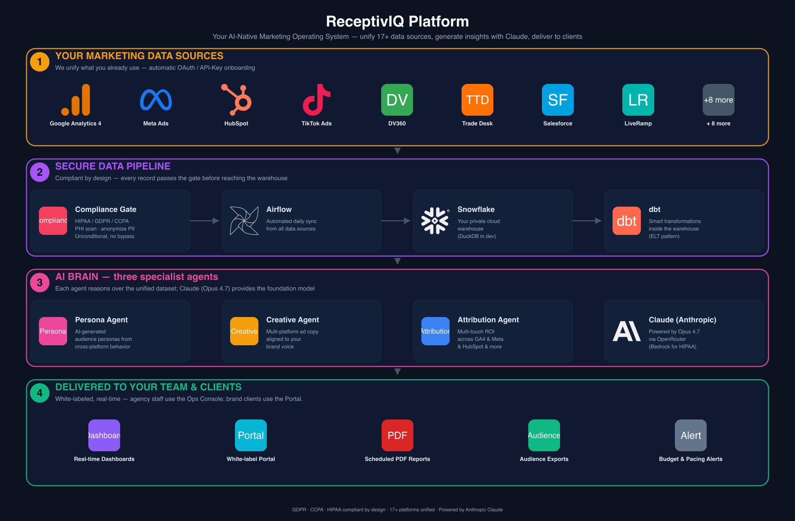
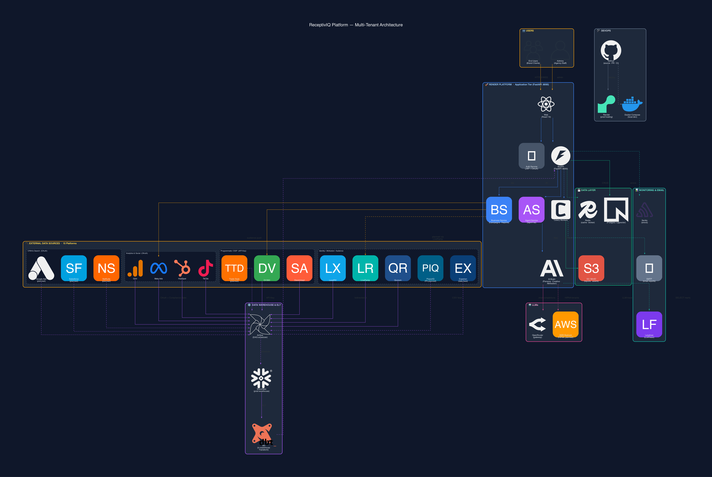
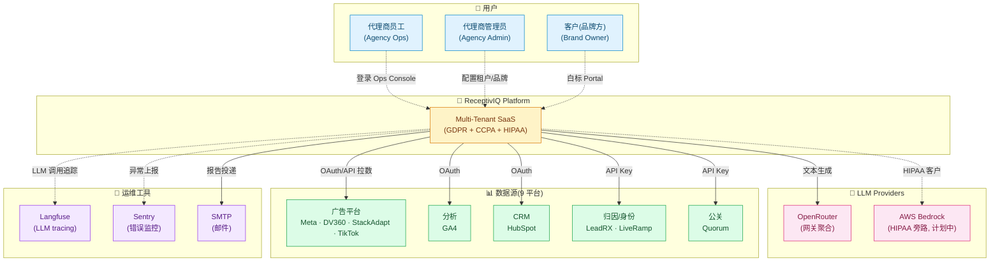
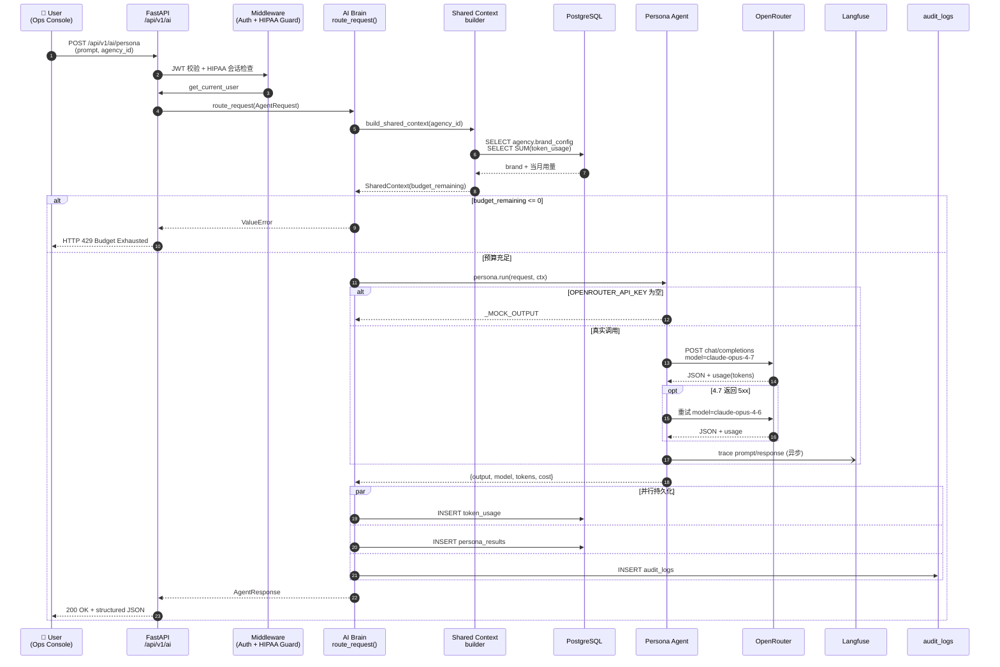
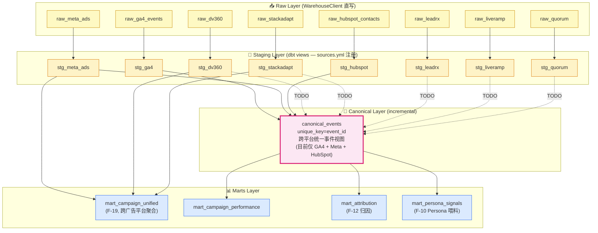
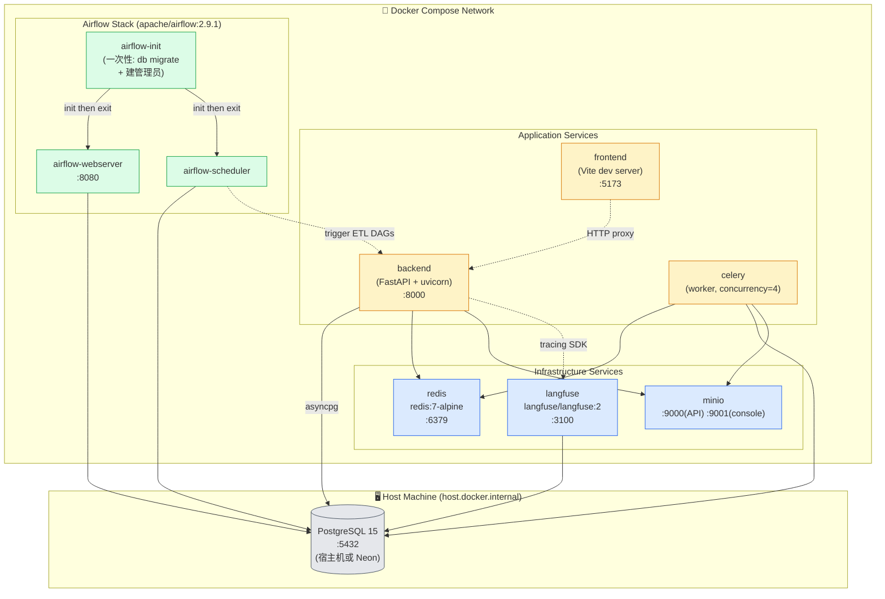
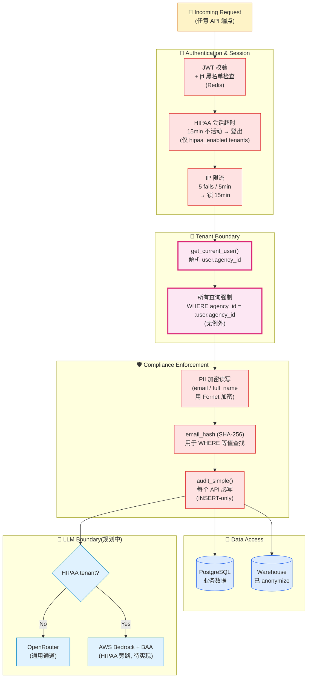

# ReceptivIQ Platform — 架构图

> 版本:v1.0 · 日期:2026-05-08
> 基于当前 worktree `claude/friendly-jepsen-64de66` 实际代码绘制
> 渲染:Mermaid(GitHub / GitLab / VSCode Mermaid Preview / Obsidian 均原生支持)

---

## 目录

- [封面图:架构海报(品牌图标版)](#封面图架构海报品牌图标版)
- [图 0:数据流水线全景(ELT + 工具链)— 新增主图](#图-0数据流水线全景elt--工具链)
- [图 1:系统上下文(C4 Level 1)](#图-1系统上下文c4-level-1)
- [图 2:应用分层架构(C4 Level 2)](#图-2应用分层架构c4-level-2--主图)
- [图 3:AI 请求时序图](#图-3ai-请求时序图)
- [图 4:ETL 数据流](#图-4etl-数据流)
- [图 5:dbt 数据分层](#图-5dbt-数据分层)
- [图 6:部署视图(Docker Compose 9 服务)](#图-6部署视图docker-compose-9-服务)
- [图 7:多租户与合规边界](#图-7多租户与合规边界)
- [图例与说明](#图例与说明)

---

## 封面图:两版海报(客户向 + 工程向)

### 客户向(主推 — 销售 / 高管演示用)

> 4 段叙事:"你的数据 → 安全管道 → AI 大脑 → 交付物"。藏掉内部微服务,使用客户能读懂的语言。



源码:[diagrams/customer-poster.py](./diagrams/customer-poster.py)

### 工程向(技术深度版 — 内部参考)

> 灵感来自 SaaS 应用架构经典模板,黑色主题 · 真实品牌 logo · 彩色聚类边框 · 全部 15 个数据源 + 内部微服务可见。



### 颜色分区一览

| 边框色    | 分区                                             | 内容                                                           |
| --------- | ------------------------------------------------ | -------------------------------------------------------------- |
| 🟠 琥珀色 | **USERS** · **EXTERNAL INTEGRATIONS** · **LLMs** | 三方接入点(用户输入、数据源、模型出口)                         |
| 🟣 紫色   | **DATA WAREHOUSE & ELT**                         | Airflow 调度 → Snowflake 加载 → dbt 转换                       |
| 🔵 蓝色   | **RENDER PLATFORM**                              | FastAPI 应用核心(Web · Auth · BizAPI · Agent · Brain · Celery) |
| 🟢 绿色   | **DATA LAYER**                                   | Neon Postgres · Redis · S3/MinIO                               |
| 🩵 青色   | **MONITORING & PLUGINS**                         | Sentry · Langfuse · SMTP                                       |
| ⚫ 灰色   | **DEVOPS**                                       | GitHub · Docker · Render                                       |

### 渲染命令

```bash
cd docs/diagrams
python3 -m pip install diagrams  # one-time
brew install graphviz            # one-time
python3 architecture-poster.py   # 输出 architecture-poster.{png,svg}
```

### 自定义图标来源

24 个品牌 PNG 来自 [simpleicons.org](https://simpleicons.org)(CC0 许可),通过 `rsvg-convert` 由 SVG 转 PNG。
缺失的品牌(DV360 / StackAdapt / LeadRX / LiveRamp / Quorum / Helicone / SES)用 `Blank` 节点配文字标签。

---

## 图 0:数据流水线全景(ELT + 工具链)

> **这是回答"数据怎么进来、怎么处理、保存到哪、用什么工具"的主图。**
> 涵盖 9 个数据层级 + 4 类外部 SaaS + DevOps 链路。


### 数据流向(自顶而下)

```
[1] 9 Third-Party Sources (GA4 / Meta / HubSpot / TikTok / DV360 / StackAdapt / LeadRX / LiveRamp / Quorum)
       │  OAuth 2.0 (5 platforms) · API Key (4 platforms)
       ▼
[2] Extraction Layer
       · Apache Airflow 2.9.1 — DAG 调度,定时触发拉取
       · Python ETL Adapters — 9 个 BaseAdapter 子类,负责 fetch / pagination / transform
       · Credential Vault — Fernet 加密的 OAuth Token / API Key
       ▼
[3] Compliance Gate(强制无旁路)
       · PHI Detector — HIPAA Safe Harbor 18 类标识符扫描
       · Anonymizer — SHA-256 + 租户盐;IPv4 → /24 截断;IPv6 → /48 截断
       · Field Mapping — 按租户的字段映射规则
       ▼
[4] Load → Cloud Warehouse(Snowflake 生产 / DuckDB 开发)
       · RAW Layer — 8 张 raw_* 表(直接 Load 目标)
       │
       │  dbt 转换(In-Warehouse,这就是 ELT 的 T)
       ▼
[5] dbt Staging → Canonical → Marts
       · Staging — 8 个视图,每平台字段标准化
       · Canonical — canonical_events(incremental + 跨源去重)
       · Marts — mart_campaign_unified / mart_attribution / mart_persona_signals / mart_campaign_performance
       ▼
[6] Application Tier(FastAPI :8000)
       · WarehouseClient — SQL 注入防护,读 Snowflake/DuckDB 给业务用
       · AI Brain + 3 Agents — LLM 调用(Persona / Creative / Attribution)
       · 21 REST Routers + 1 WebSocket
       · Celery Workers — 异步任务(报告、预算告警、ETL 调度)
       · Alembic — 数据库迁移
       ▼
[7] Operational Database(PostgreSQL 15 + pgvector)
       · 19 ORM 表:agencies/clients · users(PII Fernet 加密)· personas · creatives
       · attribution · token_usage · audit_logs · credentials(加密)· field_mapping
       · reports · notifications
       ▼
[8] Client Tier(React 19 + Vite)
       · Ops Console — 代理商员工内部视图
       · White-label Portal — 品牌客户白标门户
```

### 工具/系统全清单

| 类别              | 工具 / 系统                                                                         | 作用                                         |
| ----------------- | ----------------------------------------------------------------------------------- | -------------------------------------------- |
| **数据源**        | GA4 / Meta Ads / HubSpot / TikTok / DV360 / StackAdapt / LeadRX / LiveRamp / Quorum | 9 个三方平台                                 |
| **ETL Extract**   | Python(httpx + aiohttp)· Apache Airflow 2.9.1                                       | 拉数 + 调度                                  |
| **ETL Load**      | WarehouseClient(自研,SQL 白名单)                                                    | 写入 raw 层                                  |
| **ETL Transform** | **dbt**(在 Snowflake 内部 SQL 转换)                                                 | Staging → Canonical → Marts                  |
| **数据仓库**      | **Snowflake**(生产)/ DuckDB(开发)                                                   | 分析型存储                                   |
| **业务数据库**    | **PostgreSQL 15 + pgvector**(开发本地)/ **Neon**(生产托管)                          | 应用状态、用户数据、AI 输出                  |
| **缓存 / 队列**   | Redis 7                                                                             | db0 cache+sessions / db1 broker / db2 result |
| **对象存储**      | **AWS S3**(生产)/ **MinIO**(开发)                                                   | PDF 报告、品牌资产                           |
| **后端框架**      | **FastAPI**(Python 3.9 async) + SQLAlchemy 2.0 + Pydantic v2                        | API 层                                       |
| **前端框架**      | **React 19** + TypeScript + Vite + Ant Design                                       | 前端                                         |
| **任务队列**      | **Celery**                                                                          | 异步任务                                     |
| **LLM 网关**      | **OpenRouter**                                                                      | Claude Opus 4.7 / Sonnet 4.6 / Gemini 路由   |
| **LLM 旁路**      | **AWS Bedrock**(计划中)                                                             | HIPAA 客户 BAA 通道                          |
| **LLM Tracing**   | **Langfuse**                                                                        | Prompt / Response / Token 全链路追踪         |
| **错误监控**      | **Sentry**                                                                          | 异常上报                                     |
| **邮件**          | **SMTP**                                                                            | 报告投递                                     |
| **加密**          | **Fernet**(Python cryptography 库)                                                  | PII / 凭证字段加密                           |
| **迁移**          | **Alembic**                                                                         | PostgreSQL schema 版本管理                   |
| **源码管理**      | **GitHub**                                                                          | 仓库 · PR · CI / CD                          |
| **本地编排**      | **Docker Compose**(9 服务)                                                          | 一键起栈                                     |
| **生产部署**      | **Render**(`render.yaml` 蓝图)                                                      | Web Service + Worker + Static Site           |

### ELT vs ETL — 本项目为什么是 ELT

| 维度       | 传统 ETL                       | 本项目 ELT                                                         |
| ---------- | ------------------------------ | ------------------------------------------------------------------ |
| 顺序       | Extract → **Transform** → Load | Extract → **Load** → **Transform**                                 |
| 转换发生地 | 中间件(Python 进程内)          | **Snowflake / DuckDB 仓库内,SQL 完成**                             |
| 转换工具   | 业务代码                       | **dbt**                                                            |
| 优势       | 上游过滤,节省存储              | 保留原始 raw + 可重跑转换 + 利用仓库 MPP 计算                      |
| 本项目实现 | —                              | adapter 只做最小转换(类型 + 注入 agency_id),复杂逻辑全部下沉到 dbt |

> 项目里 `adapter.transform()` 是轻量字段转换(注入 `agency_id` + 删 raw_json + 类型转换),不做业务逻辑;真正的归一化、跨源去重、聚合,**全部在 dbt 模型内的 SQL 完成**。这是教科书式的 ELT。

### LiveRamp 在管道中的双向角色

LiveRamp 是 9 个数据源中**唯一一个有双向数据流**的平台,在图 0 里出现在 **两处**位置 — 既是入仓数据源,也是规划中的受众激活中介。

#### 角色 A:入仓数据源(当前已实现)

> 文件:[backend/app/services/etl/adapters/liveramp.py](../backend/app/services/etl/adapters/liveramp.py)

```
LiveRamp API (/v1/segments/match-rates)
  ↓  Bearer token (Fernet-decrypted from Credential Vault)
LiveRampAdapter.fetch(start_date, end_date, cursor)
  ↓  分页拉取(limit=500 / page)
records = [{date, segment_id, segment_name, match_type, matched_count, total_count, match_rate}, ...]
  ↓  LiveRampAdapter.transform()  ← hash_identifier(segment_id, agency_id)
  ↓  Compliance Gate(无旁路,与其他 8 个源一视同仁)
raw_liveramp 表(Snowflake / DuckDB)
  ↓  dbt stg_liveramp.sql(view)
                       ↑
        ⚠️ 当前 staging 已建,但 NOT 进入 canonical_events
           (与 DV360/StackAdapt/LeadRX/Quorum 一起待 promote)
```

**字段语义**:

- `segment_id` — LiveRamp 平台上的分段 ID(进仓前已 SHA-256 哈希)
- `match_type` — 匹配维度,目前看到 `cookie` / `email` 两种
- `match_rate` — 匹配率(`matched / total`),衡量受众可触达性

**当前用途**:为 attribution / persona 提供"我们的受众在 LiveRamp 上能匹配到多少真人"的指标,辅助投放预算决策。

#### 角色 B:受众激活中介(规划中,F-21 后续扩展)

> 当前 F-21 实现:[backend/app/services/audience_export/](../backend/app/services/audience_export/) —
> `meta_client.py` + `dv360_client.py` **直连**目标平台,**未经 LiveRamp**

```
PostgreSQL.personas 表(AI 生成的画像 + 受众定义)
  ↓
AudienceExportService.translator(persona → targeting_spec)
  ↓
  ├─【当前】direct push
  │    ├─→ MetaAudienceClient → graph.facebook.com/v19.0 (Custom Audience)
  │    └─→ DV360AudienceClient → displayvideo.googleapis.com/v3 (First-Party Audience)
  │         ⚠️ 标识符直接以哈希邮箱 / 设备 ID 形式上传,跨平台匹配率受限
  │
  └─【规划】via LiveRamp Identity Hub
       LiveRamp 接收原始标识符 → 解析为 RampID(跨设备/跨平台统一 ID)
       ↓
       以 RampID 为键推送到 Meta / DV360
       ↓
       平台侧匹配率显著提升(LiveRamp 内部图谱覆盖更广)
       + 合规:PII 不直接交给广告平台,中间经过 LiveRamp 的 DPA 兜底
```

**为什么规划但未实现**:

- F-21 MVP 优先验证业务闭环,直连 API 最快出 demo
- LiveRamp connector 商务合同 / API 集成成本较高,Phase 3 再做
- **触发条件**:任一客户报告 Meta/DV360 匹配率 < 40% 时,启动 LiveRamp 中介改造

#### 实现该规划需要的代码改动

| 文件                                           | 改动                                                  |
| ---------------------------------------------- | ----------------------------------------------------- |
| `services/audience_export/liveramp_client.py`  | **新建** — `resolve_to_ramp_ids()` + `push_segment()` |
| `services/audience_export/service.py`          | 在 `translator` 之后插入"identity resolution"步骤     |
| `services/platform_registry.py`                | LiveRamp 多增一个 capability:`audience_activation`    |
| `models/audience_export.py`                    | 增字段 `via_liveramp: bool`、`ramp_audience_id: str`  |
| `infra/migrations/019_liveramp_activation.sql` | 字段迁移                                              |
| `core/encryption.py`                           | LiveRamp Activation API Key 入凭证保险库(单独 scope)  |

---

## 图 1:系统上下文(C4 Level 1)

> 平台与外部世界的边界:谁来访问、谁被访问。



---

## 图 2:应用分层架构(C4 Level 2 — 主图)

> 一张图覆盖前端 / API / 服务 / 异步 / 数据 / 外部六层。**这是新人最先要看的图。**

```mermaid
flowchart TB
    subgraph CLIENT_LAYER["🖥️ Client Layer (React 19 + Vite)"]
        OPS_APP["Ops Console<br/>frontend/src/apps/ops<br/>(代理商员工)"]
        PORTAL_APP["Client Portal<br/>frontend/src/apps/portal<br/>(白标客户门户)"]
    end

    subgraph API_LAYER["⚡ API Layer — FastAPI :8000"]
        direction TB
        MIDDLEWARE["Middleware Chain<br/>CORS → Security Headers<br/>→ HIPAA Session Guard<br/>→ Request Logging"]
        ROUTERS["21 Routers /api/v1/*<br/>auth · tenants · integrations · ai<br/>personas · creatives · attribution<br/>brands · imports · field_mappings<br/>campaigns · reports · portal · ws<br/>notifications · compliance · oauth_callback<br/>credentials · health · ai · ..."]
        WS["WebSocket /ws<br/>(实时通知 F-17)"]
        MIDDLEWARE --> ROUTERS
        MIDDLEWARE --> WS
    end

    subgraph SERVICE_LAYER["🧠 Service Layer (backend/app/services/)"]
        direction LR
        subgraph AI_PILLAR["AI Pillar (services/ai/)"]
            BRAIN["Brain Router<br/>brain.route_request()<br/>· 预算熔断<br/>· 分发<br/>· 审计"]
            CONTEXT["Shared Context<br/>context.py<br/>(品牌+预算)"]
            PERSONA_AG["Persona Agent<br/>Opus 4.7(主)<br/>+ 4.6 兜底"]
            CREATIVE_AG["Creative Agent<br/>Sonnet 4.6"]
            ATTR_AG["Attribution Agent<br/>Sonnet 4.6"]
            BRAIN --> CONTEXT
            BRAIN --> PERSONA_AG
            BRAIN --> CREATIVE_AG
            BRAIN --> ATTR_AG
        end

        subgraph ETL_PILLAR["ETL Pipeline (services/etl/)"]
            ETL_RUNNER["ETL Runner<br/>runner.py<br/>extract→PHI scan<br/>→anonymize<br/>→transform→load"]
            ADAPTERS["9 Adapters<br/>(BaseAdapter 子类)<br/>ga4 · meta · hubspot<br/>dv360 · stackadapt<br/>leadrx · liveramp · quorum<br/>tiktok"]
            HIST["Historical Importer<br/>historical_importer.py"]
            ETL_RUNNER --> ADAPTERS
        end

        subgraph BUSINESS["Business Services"]
            CAMPAIGN_Q["Campaign Query<br/>campaign_query.py"]
            BUDGET["Budget Pacing<br/>budget_pacing.py"]
            REPORTS_SVC["Reports<br/>(PDF Engine F-22)"]
            AUDIENCE["Audience Export<br/>(Meta/DV360 F-21)"]
            FM["Field Mapping<br/>(F-15)"]
            NOTIF["Notifications<br/>(WS+REST F-17)"]
            OAUTH_SVC["OAuth<br/>(token refresh)"]
            PLATFORM_REG["Platform Registry<br/>(9 平台元数据)"]
        end
    end

    subgraph COMPLIANCE["🛡️ Compliance (core/compliance/ + core/)"]
        PHI_DET["PHI Detector<br/>phi_detector.py<br/>18 类 Safe Harbor"]
        ANON["Anonymizer<br/>SHA-256 + IP 截断"]
        FERNET["PII Crypto<br/>Fernet 加密<br/>(email/full_name)"]
        ENC["Credential Vault<br/>Fernet 加密<br/>(OAuth/API Key)"]
        AUDIT["Audit Log<br/>INSERT-only"]
    end

    subgraph ASYNC_LAYER["⏱️ Async Layer"]
        CELERY["Celery Workers<br/>(--concurrency=4)<br/>· budget_tasks<br/>· etl_tasks<br/>· report_tasks"]
        AIRFLOW["Airflow 2.9.1<br/>scheduler + webserver:8080<br/>(定时 ETL DAG)"]
    end

    subgraph DATA_LAYER["💾 Data Layer"]
        PG[("PostgreSQL 15 + pgvector<br/>业务库 (19 ORM models)<br/>agencies · users · personas<br/>creatives · campaigns ·<br/>token_usage · audit_logs ...")]
        WAREHOUSE[("WarehouseClient<br/>DuckDB(dev) ↔ Snowflake(prod)<br/>raw_* (8 表) → dbt → marts")]
        REDIS[("Redis 7<br/>db0=cache+JWT 黑名单+HIPAA session<br/>db1=Celery broker<br/>db2=Celery result")]
        MINIO[("MinIO / S3<br/>报告 PDF · 品牌资产")]
    end

    subgraph EXTERNAL["🌐 External Services"]
        OR_EXT["OpenRouter<br/>openrouter.ai"]
        LF_EXT["Langfuse :3100"]
        SENTRY_EXT["Sentry"]
        SMTP["SMTP"]
        PLATFORMS_EXT["9 Data Platforms<br/>(GA4, Meta, ...)"]
    end

    %% Client ↔ API
    OPS_APP -.->|REST + WS| MIDDLEWARE
    PORTAL_APP -.->|REST + WS| MIDDLEWARE

    %% API → Services
    ROUTERS --> BRAIN
    ROUTERS --> CAMPAIGN_Q
    ROUTERS --> ETL_RUNNER
    ROUTERS --> REPORTS_SVC
    ROUTERS --> AUDIENCE
    ROUTERS --> NOTIF
    ROUTERS --> OAUTH_SVC
    ROUTERS --> PLATFORM_REG
    ROUTERS --> HIST
    WS --> NOTIF

    %% API → Compliance(每个端点强制)
    ROUTERS -.->|强制调用| AUDIT
    ROUTERS -.->|读写解密| FERNET

    %% AI → External & Data
    PERSONA_AG -->|POST chat/completions| OR_EXT
    CREATIVE_AG -->|POST chat/completions| OR_EXT
    ATTR_AG -->|POST chat/completions| OR_EXT
    PERSONA_AG -.->|trace| LF_EXT
    CREATIVE_AG -.->|trace| LF_EXT
    ATTR_AG -.->|trace| LF_EXT
    BRAIN -->|token_usage| PG
    BRAIN -->|persona_results| PG

    %% ETL → Compliance → Warehouse
    ETL_RUNNER --> PHI_DET
    ETL_RUNNER --> ANON
    ETL_RUNNER --> WAREHOUSE
    ETL_RUNNER -->|OAuth/API Key| PLATFORMS_EXT
    ADAPTERS -->|解密凭证| ENC

    %% Async wiring
    CELERY -->|tasks| REPORTS_SVC
    CELERY -->|tasks| ETL_RUNNER
    CELERY -->|tasks| BUDGET
    CELERY <-->|broker/result| REDIS
    AIRFLOW -->|trigger| ETL_RUNNER

    %% Reports → Storage / Email
    REPORTS_SVC --> MINIO
    REPORTS_SVC --> SMTP

    %% Persistence
    ROUTERS --> PG
    ROUTERS --> REDIS
    CAMPAIGN_Q --> WAREHOUSE
    AUDIENCE --> WAREHOUSE
    AUDIT --> PG
    FERNET <--> PG
    ENC <--> PG

    %% Error & observability
    SERVICE_LAYER -.->|exceptions| SENTRY_EXT
    API_LAYER -.->|exceptions| SENTRY_EXT

    classDef client fill:#e0f2fe,stroke:#0284c7
    classDef api fill:#fef3c7,stroke:#d97706
    classDef ai fill:#fce7f3,stroke:#db2777
    classDef etl fill:#dcfce7,stroke:#16a34a
    classDef biz fill:#ede9fe,stroke:#7c3aed
    classDef compl fill:#fee2e2,stroke:#dc2626
    classDef async fill:#fef9c3,stroke:#ca8a04
    classDef data fill:#dbeafe,stroke:#2563eb
    classDef ext fill:#e5e7eb,stroke:#4b5563

    class OPS_APP,PORTAL_APP client
    class MIDDLEWARE,ROUTERS,WS api
    class BRAIN,CONTEXT,PERSONA_AG,CREATIVE_AG,ATTR_AG ai
    class ETL_RUNNER,ADAPTERS,HIST etl
    class CAMPAIGN_Q,BUDGET,REPORTS_SVC,AUDIENCE,FM,NOTIF,OAUTH_SVC,PLATFORM_REG biz
    class PHI_DET,ANON,FERNET,ENC,AUDIT compl
    class CELERY,AIRFLOW async
    class PG,WAREHOUSE,REDIS,MINIO data
    class OR_EXT,LF_EXT,SENTRY_EXT,SMTP,PLATFORMS_EXT ext
```



---

## 图 3:AI 请求时序图

> 一次 Persona 生成请求从前端到 LLM 再回写的完整链路。



---

## 图 4:ETL 数据流

> 一次 ETL sync 从外部平台到仓库的全过程,**强调合规节点**。

```mermaid
flowchart LR
    subgraph SRC["📡 数据源(示例: Meta Ads)"]
        META_API["Meta Graph API<br/>/insights"]
    end

    subgraph EXTRACT["1️⃣ Extract"]
        ADAPTER["MetaAdsAdapter.fetch()<br/>(BaseAdapter 子类)"]
        CRED["Credential Vault<br/>Fernet 解密 OAuth Token"]
    end

    subgraph COMPLY_STAGE["2️⃣ Compliance Gate(强制,无例外)"]
        PHI_SCAN["phi_detector.scan_record()<br/>HIPAA 18 类标识符检测"]
        ANON_STAGE["anonymize_record_for_warehouse()<br/>· SHA-256(value, agency_salt)<br/>· truncate_ip(/24)<br/>· drop raw_json"]
    end

    subgraph TRANSFORM["3️⃣ Transform"]
        TFM["adapter.transform(record)<br/>(子类自定义字段映射)"]
        INJECT["注入 agency_id + client_id<br/>(租户上下文)"]
    end

    subgraph LOAD["4️⃣ Load"]
        WH_CLIENT["WarehouseClient.insert_many()<br/>· _ALLOWED_TABLES 白名单<br/>· _COL_PATTERN 列名校验"]
        WH_TABLE[("raw_meta_ads<br/>(DuckDB / Snowflake)")]
    end

    subgraph SYNC_STATE["5️⃣ Sync State"]
        STATE["update_sync_state()<br/>(cursor + records_written)"]
        SYNC_TABLE[("sync_logs")]
    end

    META_API -->|HTTPS| ADAPTER
    CRED -.->|OAuth Token| ADAPTER
    ADAPTER -->|raw records| PHI_SCAN
    PHI_SCAN -->|log if PHI found| ANON_STAGE
    ANON_STAGE -->|cleansed records| TFM
    TFM --> INJECT
    INJECT --> WH_CLIENT
    WH_CLIENT --> WH_TABLE
    WH_CLIENT --> STATE
    STATE --> SYNC_TABLE

    classDef src fill:#dcfce7,stroke:#16a34a
    classDef extract fill:#fef3c7,stroke:#d97706
    classDef comply fill:#fee2e2,stroke:#dc2626,stroke-width:3px
    classDef tfm fill:#ede9fe,stroke:#7c3aed
    classDef load fill:#dbeafe,stroke:#2563eb
    classDef state fill:#f3e8ff,stroke:#9333ea

    class META_API src
    class ADAPTER,CRED extract
    class PHI_SCAN,ANON_STAGE comply
    class TFM,INJECT tfm
    class WH_CLIENT,WH_TABLE load
    class STATE,SYNC_TABLE state
```



> 🛡️ **合规边界**:红色框 = Compliance Gate,**所有记录无条件经过**,即使 PHI 检测未命中也强制 anonymize。设计动机参见 `services/etl/runner.py` 第 33-38 行(C-2 修复)。

---

## 图 5:dbt 数据分层

> 仓库内部的 SQL 转换层级,**Canonical 是所有 AI Agent 的唯一数据源**。



> ⚠️ **已知 Schema TODO**:虚线箭头表示 staging 已建但**未进 canonical**,AI Agent 当前看不到 DV360/StackAdapt/LeadRX/LiveRamp/Quorum 数据。
> 例外:`mart_campaign_unified` 直接读 staging 绕过 canonical,因 canonical 缺 reach / conversion_value 等列。

---

## 图 6:部署视图(Docker Compose 9 服务)

> 来源:[docker-compose.yml](../docker-compose.yml) — 本地一键起栈。



**生产对应**:

- `backend / celery` → Render Web Service / Worker
- `frontend` → Render Static Site
- `redis` → Upstash 或 Render Redis
- `minio` → AWS S3
- `langfuse` → Langfuse Cloud
- `airflow-*` → Render(或独立 Airflow 实例)
- PostgreSQL → Neon

---

## 图 7:多租户与合规边界

> 数据隔离与法规边界的可视化 — 每条请求都要穿过这套护栏。



---

## 图例与说明

### 颜色编码(全文档统一)

| 颜色     | 含义                       |
| -------- | -------------------------- |
| 🟦 蓝    | Client(前端)/ Data(数据层) |
| 🟨 黄    | API / 配置层               |
| 🟪 粉/紫 | AI / Canonical(核心契约)   |
| 🟩 绿    | ETL / 数据源               |
| 🟥 红    | Compliance(强制边界)       |
| ⬜ 灰    | External(外部系统)         |

### 线条语义

| 线型          | 含义                                                      |
| ------------- | --------------------------------------------------------- |
| `─→` 实线     | 同步调用 / 主数据流                                       |
| `╌→` 虚线     | 异步 / 可选 / 可观测性旁路                                |
| `═→` 加粗虚线 | TODO / 计划中(如 Bedrock 通道、未进 canonical 的 staging) |

### 重要事实速查(从图中得到的洞察)

1. **所有 LLM 流量经过 Brain 一个入口** — 利于统一计费、审计、预算控制
2. **ETL 的 Compliance Gate 无旁路** — Anonymize 强制对所有记录执行,即使 PHI 检测未命中
3. **Canonical 层是 AI 的唯一数据源** — 但目前 5 个新接入平台还未进入,是已知差距
4. **HIPAA 路由分支待实现** — 当前所有 LLM 流量都走 OpenRouter,这与销售合同的 HIPAA 承诺存在 gap(详见 [PSD-LLM-SELECTION-DECISION.md](./PSD-LLM-SELECTION-DECISION.md) §R-01)
5. **PostgreSQL 是宿主机服务,不在 Compose 内** — 通过 `host.docker.internal:5432` 访问,生产用 Neon

### 配套文档

- 实现细节 → [ARCHITECTURE-DEEP-DIVE.md](./ARCHITECTURE-DEEP-DIVE.md)
- LLM 选型决策 → [PSD-LLM-SELECTION-DECISION.md](./PSD-LLM-SELECTION-DECISION.md)
- 项目路线图 → [features/PROJECT-PLAN.md](../features/PROJECT-PLAN.md)
- 合规规则 → [CLAUDE.md](../CLAUDE.md) §Compliance Rules

---

## 如何渲染本文档

- **GitHub / GitLab**:直接打开,Mermaid 自动渲染
- **VSCode**:安装 "Markdown Preview Mermaid Support" 扩展,`Cmd+Shift+V` 预览
- **Obsidian**:原生支持
- **导出 PNG/SVG**:
  ```bash
  npx @mermaid-js/mermaid-cli -i ARCHITECTURE-DIAGRAM.md -o diagrams/
  ```
- **在线编辑**:复制单个 `mermaid` 代码块到 https://mermaid.live

---

> 文档版本历史
> v1.0 · 2026-05-08 · 初版,基于当前 main 分支 + worktree `claude/friendly-jepsen-64de66`,覆盖 7 个视角(上下文 / 分层 / AI 时序 / ETL 流 / dbt 分层 / 部署 / 合规边界)
