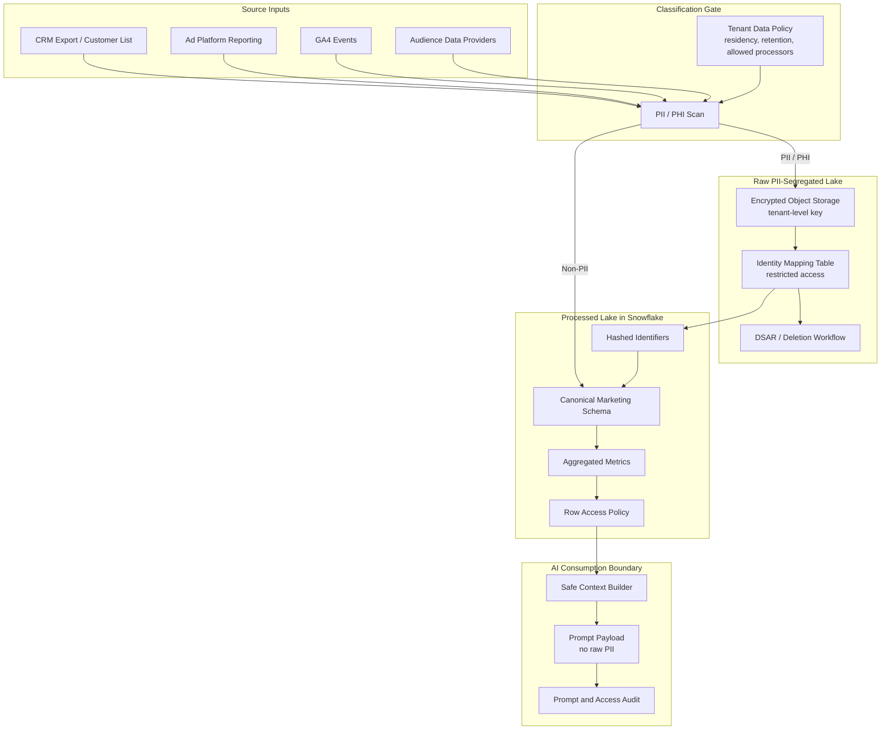
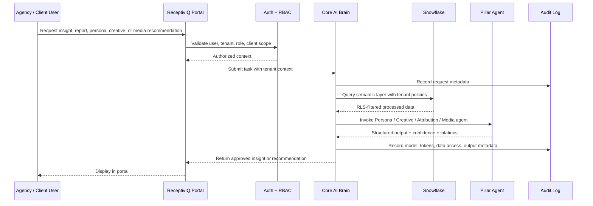

# Network Diagram

本文件展示 ReceptivIQ 的高层网络与数据流。重点表达三个边界：

1. 外部数据源边界：第三方供应商、广告平台、分析平台和安全文件传输。
2. 合规边界：PII/PHI 在摄取阶段进入隔离湖，不直接进入通用 processed lake。
3. 智能边界：Core AI Brain 只通过权限控制和经过处理的数据访问上下文。

## 1. High-Level Data Flow

```mermaid
flowchart LR
    subgraph EXT["External Data Sources"]
        EXP["Experian"]
        TU["TransUnion"]
        NLS["Nielsen"]
        PLC["Placer IQ"]
        QRM["Quorum"]
        DV["DV360"]
        META["Meta"]
        TT["TikTok"]
        TTD["The Trade Desk"]
        GA4["GA4"]
        TR["Tresorit<br/>Compliant CRM Transfer"]
    end

    subgraph ING["Secure Ingestion Layer"]
        AUTH["OAuth / API Key / Service Account<br/>Credential Vault"]
        FILE["Encrypted File Intake"]
        API["API Extractors"]
        CLASS["Data Classification<br/>Public / Internal / PII / PHI"]
    end

    subgraph COMP["Compliance Boundary"]
        RAWPII["Raw PII-Segregated Lake<br/>Encrypted, tenant-keyed, audited"]
        TOKEN["Tokenization / Hashing<br/>Tenant-scoped join keys"]
    end

    subgraph ELT["ELT Pipeline"]
        LOAD["Load to Staging"]
        NORM["Transform: Normalize"]
        DEDUP["Deduplicate"]
        VALID["Validate"]
        ENRICH["Enrich"]
        INDEX["Index"]
        QUAR["Quarantine<br/>failed or unsafe records"]
    end

    subgraph WH["Snowflake Warehouse"]
        RAWNON["Processed Lake<br/>Non-PII canonical data"]
        RLS["Row-Level Security<br/>tenant_id / client_id"]
        SEM["Semantic Layer"]
        VEC["AI Retrieval Index<br/>no raw PII"]
        CLONE["Zero-Copy Clones<br/>tenant replication / QA"]
    end

    subgraph AI["Core AI Brain"]
        ROUTER["LLM Router"]
        CTX["Context Builder"]
        ORCH["Agent Orchestrator"]
        AUDIT["AI Audit + Token Budget"]
    end

    subgraph AGENTS["Pillar Agents"]
        PA["Persona Agent"]
        CA["Creative Agent"]
        AA["Attribution Agent"]
        MA["Media Agent"]
    end

    subgraph APP["Application and Portal Layer"]
        MR["Market Research"]
        CE["Creative Engine"]
        MB["Media Buying"]
        AT["Attribution"]
        CP["Client Portal"]
        AP["Agency Portal"]
    end

    EXP --> API
    TU --> API
    NLS --> API
    PLC --> API
    QRM --> API
    DV --> API
    META --> API
    TT --> API
    TTD --> API
    GA4 --> API
    TR --> FILE

    AUTH --> API
    API --> CLASS
    FILE --> CLASS

    CLASS -->|PII / PHI| RAWPII
    RAWPII --> TOKEN
    TOKEN --> LOAD
    CLASS -->|Non-PII| LOAD

    LOAD --> NORM
    NORM --> DEDUP
    DEDUP --> VALID
    VALID -->|pass| ENRICH
    VALID -->|fail| QUAR
    ENRICH --> INDEX
    INDEX --> RAWNON

    RAWNON --> RLS
    RLS --> SEM
    SEM --> VEC
    RLS --> CLONE

    SEM --> CTX
    VEC --> CTX
    CTX --> ROUTER
    ROUTER --> ORCH
    ORCH --> PA
    ORCH --> CA
    ORCH --> AA
    ORCH --> MA
    AUDIT --- ROUTER
    AUDIT --- ORCH

    PA --> MR
    CA --> CE
    MA --> MB
    AA --> AT
    MR --> AP
    CE --> AP
    MB --> AP
    AT --> AP
    AT --> CP
    MR --> CP
```

## 2. PII Segregation Architecture

## 3. Runtime Request Flow

## 4. Compliance Boundary Notes

- PII/PHI enters the Raw PII-Segregated Lake first; it does not bypass the classification gate.
- Processed Lake data is the default source for Snowflake analytics and AI context.
- Tenant isolation exists at multiple layers: credential vault, file storage path, Snowflake row access policy, application RBAC, audit logging.
- Data residency must be evaluated before choosing tenant region, Snowflake region, object storage region, and model-processing region.
- Media platform write-back is separated from read/reporting flows and should require human approval in MVP.
