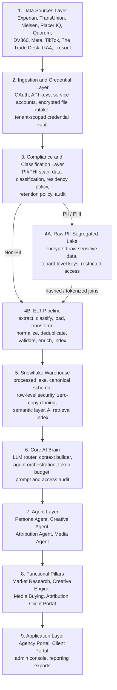

# Architecture Solution Schema

## 1. Full Platform Architecture

## 2. Layer-by-Layer Schema

### 2.1 Data Sources Layer

| Category | Systems | Primary Data |
| --- | --- | --- |
| Market intelligence | Experian, TransUnion, Nielsen | audience segments, demographics, psychographics, market measurement |
| Location and civic/behavior signals | Placer IQ, Quorum | location patterns, region-level behavior, audience context |
| Paid media / DSP | DV360, Meta, TikTok, The Trade Desk | campaigns, line items/ad groups, creative, spend, delivery, conversion |
| Analytics | GA4 | events, sessions, conversions, traffic source, ecommerce |
| Secure transfer | Tresorit | compliant CRM transfer, customer lists, regulated file intake |

### 2.2 ELT Pipeline Layer

| Step | Function | Output |
| --- | --- | --- |
| Extract | Pull data from APIs or encrypted files | source batch |
| Classify | Detect PII/PHI and data level | routed records |
| Load | Load safe raw/staging data into Snowflake or the PII-segregated lake | auditable staged data |
| Transform: Normalize | Map source fields to canonical schema inside Snowflake | standardized entities |
| Transform: Deduplicate | Remove duplicate records across pulls/files | clean source records |
| Transform: Validate | Enforce schema, type, range, and safety rules | accepted or quarantined data |
| Transform: Enrich | Add tenant/client mapping, taxonomy, audience labels | business-ready data |
| Transform: Index | Build query, semantic, and AI retrieval indexes | warehouse-ready and AI-ready data |

### 2.3 Snowflake Warehouse Layer

Recommended schemas:

| Schema | Purpose |
| --- | --- |
| `raw_secure` | references to encrypted PII files and restricted metadata only |
| `staging` | normalized source-specific tables |
| `canonical` | unified entities across platforms |
| `marts` | reporting-ready tables for campaign, persona, attribution, portal |
| `ai_context` | AI-safe summaries, embeddings, retrieved context, prompt citations |
| `audit` | data access, ELT runs, AI requests, compliance events |

Canonical entities:

- `tenant`
- `client`
- `data_source`
- `campaign`
- `media_placement`
- `creative_asset`
- `audience_segment`
- `persona`
- `touchpoint`
- `conversion_event`
- `attribution_result`
- `report`
- `audit_event`

### 2.4 Core AI Brain and Agents

| Component | Responsibility |
| --- | --- |
| Context Builder | Gathers tenant-safe, role-safe, PII-safe context from Snowflake |
| LLM Router | Selects model by agent, cost, latency, compliance and tenant policy |
| Agent Orchestrator | Coordinates persona, creative, attribution and media agents |
| Tool Executor | Calls approved read/write tools, with write-back approval gates |
| Memory and Retrieval | Uses summaries and vector retrieval without raw PII |
| Audit and Cost Control | Logs prompts, outputs, tokens, data access and model decisions |

Agents:

| Agent | MVP Role |
| --- | --- |
| Persona Agent | Generate audience blueprints and market research outputs |
| Creative Agent | Generate creative concepts, copy, and brand-aligned recommendations |
| Attribution Agent | Explain performance, touchpoints and contribution by channel |
| Media Agent | Recommend budget and media optimizations; write-back is gated |

### 2.5 Functional Pillars

MVP scope:

| Pillar | Function |
| --- | --- |
| Market Research | Audience blueprint generation, persona research, third-party data synthesis |
| Creative Engine | Creative concepts, copy variants, brand voice support, performance-informed suggestions |
| Media Buying | Campaign monitoring, pacing, optimization recommendations, human-approved actions |
| Attribution | Multi-touch performance analysis, channel impact, reporting narratives |
| Client Portal | White-labeled dashboards, AI summaries, report access, role-filtered visibility |

Portal layer:

| User Type | Primary Experience |
| --- | --- |
| Agency operator | Daily campaign health, research, creative, media and attribution workflows |
| Agency admin | Tenant settings, clients, users, integrations, billing and audit visibility |
| Client viewer | White-labeled summaries, performance reports, approved insights |
| Internal super-admin | Tenant provisioning, integration status, platform health, support visibility |

## 3. Technical Constraints

These constraints should feed the prioritization tool run.

| Constraint | Impact on Prioritization |
| --- | --- |
| Unified canonical schema must be locked early | Expensive to retrofit after integrations and agents are built |
| PII segregation is architectural, not optional | Affects ingestion, storage, AI context, audit and deletion workflows |
| Snowflake RLS must be designed before tenant data lands | Prevents cross-tenant leakage and supports enterprise readiness |
| Data residency is per tenant | Affects Snowflake region, object storage, backups and model provider routing |
| Source contracts may lag technical work | Experian, TransUnion, Nielsen and other providers may require sample-file fallback |
| Media platform write access may be delayed | MVP should support read/reporting first and gate write-back actions |
| GA4 and media historical data may require batch backfill | Onboarding expectations need clear processing lead-time communication |
| Tresorit is a secure transfer path, not a normalized CRM schema | CRM file ingestion still needs mapping, validation and PII handling |
| SSO is post-MVP | MVP must still include secure auth, RBAC, tenant isolation and audit |
| AI cannot consume raw PII by default | Requires AI-safe context builder and redaction/tokenization rules |

## 4. Technical Dependencies

| Dependency | Required For | Priority Signal |
| --- | --- | --- |
| Tenant model and isolation policy | All product pillars | P0 |
| Canonical marketing schema | ELT, reporting, AI agents | P0 |
| PII classification and routing | Compliance, CRM transfer, AI safety | P0 |
| Snowflake account, region and role design | Warehouse and data residency | P0 |
| Credential vault | All API integrations | P0 |
| ELT orchestration and monitoring | Integrations and data freshness | P0 |
| Experian sample data | Market Research MVP | P0 |
| GA4 and media historical exports | Attribution and onboarding demo | P0 |
| DV360, Meta, TikTok, The Trade Desk API access | Media Buying and reporting | P0/P1 depending on write access |
| Tresorit transfer process | Compliant CRM intake | P0 |
| LLM provider decision | Core AI Brain and cost controls | P0 |
| Human approval workflow | Media write-back, budget changes | P1 |
| Google / Office365 SSO | Enterprise auth | Post-MVP |

## 5. Prioritization Inputs

Recommended MVP sequencing:

1. Foundation architecture: tenant model, compliance boundary, canonical schema, Snowflake structure.
2. Secure ingestion: credential vault, file intake, Tresorit flow, API connector framework.
3. Priority read connectors: Experian sample ingestion, GA4, Meta, DV360, TikTok, The Trade Desk.
4. Processed Lake and marts: campaign performance, audience/persona, attribution-ready tables.
5. Core AI Brain: LLM router, context builder, audit, token budget.
6. Market Research pillar: Persona Agent and audience blueprint workflow.
7. Attribution and Client Portal: reporting, AI summaries, white-labeled views.
8. Creative and Media recommendations: agent-generated suggestions.
9. Write-back automation: media actions with approval gates.
10. Post-MVP enterprise auth: Google SSO, Office365 SSO, SCIM/SAML.

## 6. Architecture Decision Summary

| Area | Decision |
| --- | --- |
| Warehouse | Snowflake |
| Data lakes | Raw PII-Segregated Lake + Processed Lake |
| Isolation | Tenant-aware schemas, RLS, optional per-tenant database/account |
| ELT | Extract, classify, load, transform, normalize, deduplicate, validate, enrich, index |
| AI | Core AI Brain with LLM Router and agent orchestration |
| MVP pillars | Market Research, Creative Engine, Media Buying, Attribution, Client Portal |
| Compliance | GDPR, CCPA, HIPAA, SOC 2 |
| Residency | Tenant-level requirement |
| Auth | Basic auth/RBAC in MVP; Google and Office365 SSO post-MVP |
